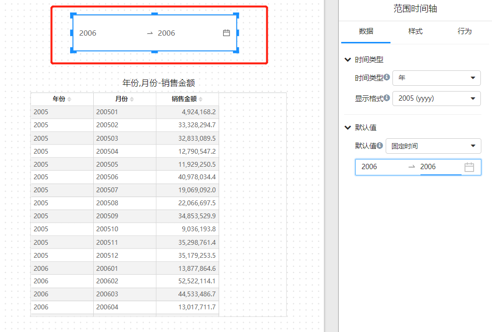

# 时间轴

## “时间轴"有什么用？

时间轴的用处是通过”时间轴筛选“组件筛选模型上的多个”时间字段“。

比如，模型中有”销售日期“、”采购日期“、”进货日期“，或者有不同时间粒度的指标，比如”销售预算金额“粒度到”年“，”销售金额“粒度到”天“。

那么如何通过一个时间筛选组件筛选页面这些模型的不同组件，这时候就需要用到”时间轴“。

## 如何使用”时间轴“？

1. 图表组件设置”时间轴“字段

   

2. 报表页面上添加”时间轴“筛选组件

   

3. 将筛选组件和图表组件建立订阅关系

   

