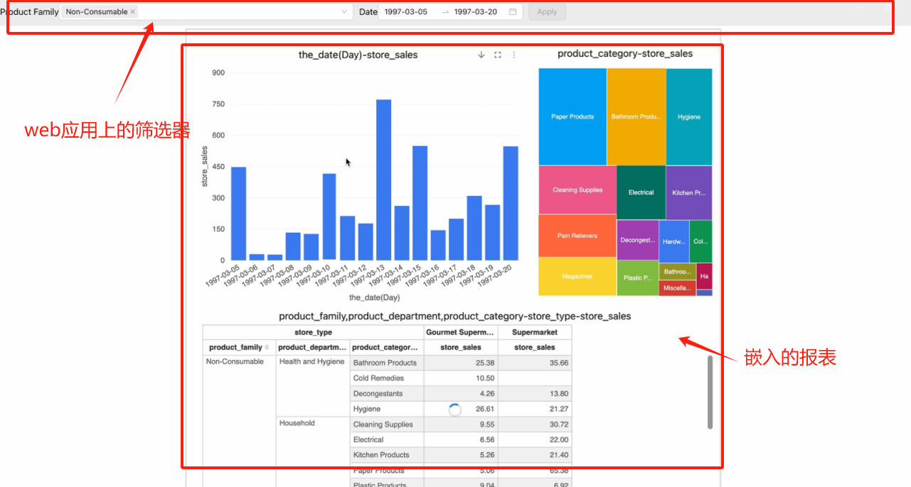

# XDM方式嵌入报表

> [!NOTE]
>
> 本文档中的”**报表**“是指通过Datafor或Visualizer插件创建的可视化报表。

报表支持XDM（跨文档消息传输）方式，过滤报表数据（无需刷新报表页）。XDM方式可控制报表的数据过滤、样式、行为，本篇只讨论数据过滤的场景。

## 场景：

在Web应用中通过iframe嵌入报表时，可能有以下需求：

1. 过滤报表初次加载的数据
2. 在不刷新报表的情况下，动态过滤报表数据

## 原理：

Web应用通过postMessage方式与报表进行通信，向报表发送过滤参数。报表将参数作为过滤器分发给各个图表组件，各个图表重新发起查询以实现数据过滤功能。

## 使用方法：

1. **在报表URL中添加查询参数：**

   在主程序里打开报表时，在报表地址链接中添加查询参数`__xdmTimeout=150`，例如：`http://hostname:port/datafor/index.html?__xdmTimeout=150`。

   说明：打开报表后，报表启动到特定阶段，会发出报表初始化广播信息，并等待150ms，如果等待时间内收到有效回应，便将回应里的有效信息作为报表初次加载的数据筛选条件。可以根据主程序响应的速度调整这个延迟时间。如果不需要在报表初次加载时过滤数据，则可以不添加这个参数。

2. **在主程序中引入XMDWorker类：**

   在主程序中添加如下类XMDWorker，用于转发XDM消息。主程序可以基于这个类的send方法，将过滤参数传递给报表。

   ```js
   class XMDWorker {
       constructor({ onPageInitEvent = () => { } }) {
           this.reportId = null;
           window.addEventListener('message', (msg) => {
               const { data } = msg;
               let reportMessage;
               try { reportMessage = JSON.parse(data); } catch (d) { }
               if (reportMessage) {
                   if (reportMessage.event == 'visualizerReportFileLoaded') {
                       this.reportId = reportMessage.id;
                       onPageInitEvent();
                   }
               }
           });
       }

       send(data, target, init = false) {
           if (!this.reportId) {
               console.error('No reportId found, please wait for the report to be loaded');
               return;
           }
           const message = {
               trustMark: this.reportId,
               event: 'query',
               init,
               filters: data,
           };
           target?.postMessage(JSON.stringify(message), '*');
       }
   }
   ```

3. **在创建iframe打开报表前初始化XDMWorker对象：**

   在创建iframe打开报表前，初始化一个XDMWorker对象。如需在报表初次加载时过滤报表数据，请在`onPageInitEvent`事件中调用send方法，并将第三个参数指定为true。

   ```js 
   const xdm = new XMDWorker({
       onPageInitEvent: () => {
           iframeRef?.current && xdm.send(
               [
                   //message
               ], 
               iframeRef.current?.contentWindow, 
               true
           );
       }
   });
   ```

4. **动态控制报表过滤参数：**

   报表页面打开后，如需动态控制报表过滤参数，可以在主程序中调用send方法，将过滤参数传递给报表。报表会即时响应，重新查询数据。

5. **send方法调用格式：**

   ```js   
   send(message, target, init)
   ```

   参数说明：
   - `message`: 过滤参数数组，格式如下：
     ```js
     [{
         value: [
             [
                 {i: 0|1, v: string|number},  // 范围过滤：包括i属性（取值0或1）和v属性（边界值，数字或字符串）
                 {i: 0|1, v: string|number}
             ], 
             string|number,  // 原始值
             ...
         ],  
         name: string,  // 目标报表页面中多维分析模型里目标level的uniqueName属性值
         type: string,  // 过滤作用类型，可选值：name, caption
         datatype: string|number|timestamp  // 过滤值的数据类型
     }]
     ```
   - `target`: 打开Visualizer报表的iframe所属窗口对象
   - `init`: 是否为报表初次加载时的过滤参数，布尔值

6. **完整示例：**

   请参考示例项目：[使用XDM方式传递消息给报表](https://github.com/datafor123/visualizer-xmd-demo/tree/main)。
   <div align="left"></div>

7. **在新窗口或新标签页中打开报表：**

   新窗口或新浏览器标签页中打开报表，也可以使用XDM方式过滤报表数据。