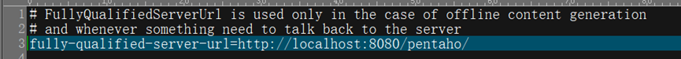

# Visualizer(PBA插件)安装

1. 将 **Visualizer.zip** 解压缩到 **pentaho-solutions\system** 目录。

   <div align="left"></div>
   
2. 修改 **pentaho-solutions\system** 目录中的 **ImportHandlerMimeTypeDefinitions.xml** 文件，并添加以下内容。

   ```
   <MimeTypeDefinition mimeType="application/octet-stream" hidden="false">
           <extension>eml</extension>
           <extension>datafor</extension>
   </MimeTypeDefinition>
   ```

   <div align="left"></div>

3. 修改 **pentaho-solutions\system** 目录中的 **applicationContext-spring-security.xml** 文件，并添加以下内容。

   ```
   <sec:intercept-url pattern="\A/content/datafor/.*\Z" access="Anonymous,Authenticated" />
   ```
   <div align="left"></div>

   ```
    <sec:intercept-url pattern="\A/plugin/datafor/api/.*\Z" access="Anonymous,Authenticated" />
   ```

   <div align="left"></div>

4. 修改 **pentaho-solutions\system** 目录中的 **server.properties** 文件，将服务器地址更改为生成共享链接地址的相应 URL。

   <div align="left"></div>

5. 安装字体（用于Excel导出）

   如果无法导出Excel文件，可能是因为正在使用OpenJDK而未安装字体。请以root用户身份在服务器上执行以下命令以安装字体。

   ```
   yum install fontconfig
   fc-cache --force
   ```

6. 重启 PBA

   <div align="left"></div>

