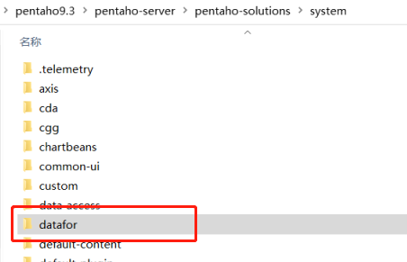
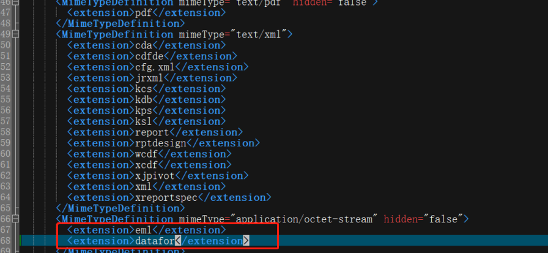
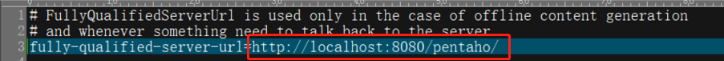
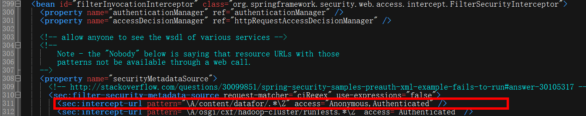
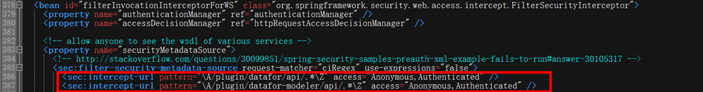

# 在PBA安装Visualizer插件

1. 解压Datafor.zip到pentaho-solutions\system目录下。

   <div align="left"></div>

2. 修改pentaho-solutions\system目录中的ImportHandlerMimeTypeDefinitions.xml文件，添加如下内容：

   ```
   <MimeTypeDefinition mimeType="application/octet-stream" hidden="false">
           <extension>eml</extension>
           <extension>datafor</extension>
   </MimeTypeDefinition>
   ```
   <div align="left"></div>


3. 修改pentaho-solutions\system目录中的server.properties，修改server地址为对应的网址，用于生成分享链接地址。

   <div align="left"></div>

   修改pentaho-solutions\system目录中的applicationContext-spring-security.xml。

   在id=”filterInvocationInterceptor” 的bean中如图位置增加：

   ```
   <sec:intercept-url pattern="\A/content/datafor/.*\Z" access="Anonymous,Authenticated" />
   ```

   <div align="left"></div>

   在id=”filterInvocationInterceptorForWS” 的bean中如图位置增加：

   ```
   <sec:intercept-url pattern="\A/plugin/datafor/api/.*\Z" access="Anonymous,Authenticated" />
   <sec:intercept-url pattern="\A/plugin/datafor-modeler/api/.*\Z" access="Anonymous,Authenticated" />
   ```

   <div align="left"></div>

4. 安装字体（Excel导出需要）。

   若无法导出excel,可能是使用了openjdk没有安装字体，请用root用户在服务器上执行以下命令安装字体。

   ```
   yum install fontconfig
   fc-cache --force
   ```

5. 重启系统。