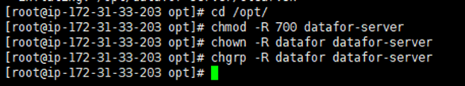
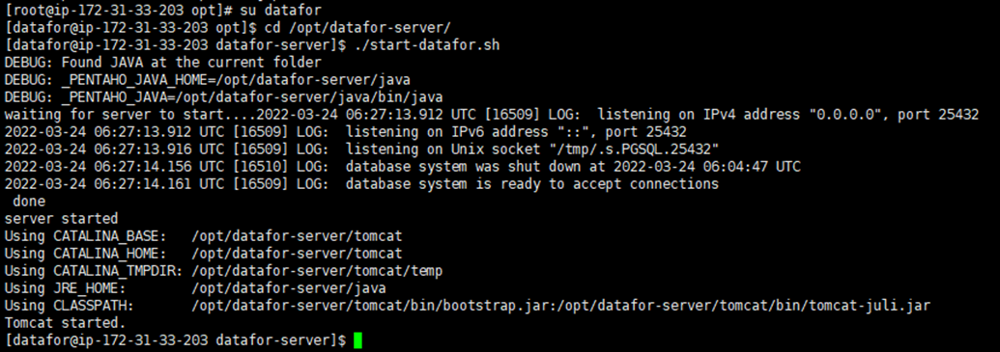

# 安装Datafor（Centos环境）
 **步骤1. 切换root用户**

```
sudo su root
```

<div align="left"></div>

 **步骤2. 创建datafor用户组**

```
groupadd datafor
```

<div align="left"></div>

 **步骤3. 创建datafor用户并添加到datafor用户组，并将用户密码也设置为datafor**

```
adduser datafor -g datafor
passwd datafor
```

<div align="left"></div>

**步骤4. 进入安装包所在目录，将安装包解压至/opt路径下**

```
unzip -o datafor-server_202203240605.zip -d /opt/
```

<div align="left"></div>

**步骤5. 解压完成后，进入/opt/目录，修改权限**

```
cd /opt/
chmod -R 700 datafor-server
chown -R datafor datafor-server
chgrp -R datafor datafor-server
```

<div align="left"></div>

**安装完毕**

启停服务，参见日常启动

## 日常启动

**日常启停，请以datafor用户操作**

```
su datafor
cd /opt/datafor-server/
```

**启动服务**

```
./start-datafor.sh
```

<div align="left"></div>

**停止服务**

```
./stop-datafor.sh
```

<div align="left"></div>

**查看服务启停状态**

```
ps -ef|grep tomcat
```

<div align="left"></div>

命令如上输出，则表示服务处于运行状态