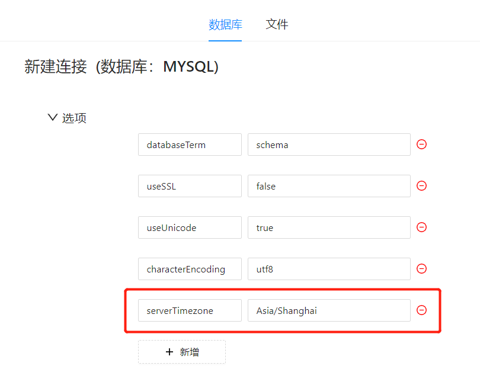

# JDBC时区设置

JDBC需要有时区参数设置，是因为不同的数据库在存储和计算时间时都是基于特定的时区。如果JDBC连接没有设置时区，那么它会默认使用本地计算机的时区，而这可能与数据库的时区不一致，导致时间戳的转换错误。例如，如果数据库时区设置为UTC，而JDBC连接使用本地时区，则会出现时间戳偏差的情况。因此，在进行数据库操作时，我们需要通过设置JDBC连接的时区参数，以确保正确的时间戳转换，避免出现时间偏差问题。

## 如何设置时区参数

在数据库连接配置的“选型”中新增参数，设置时区参数和值。

