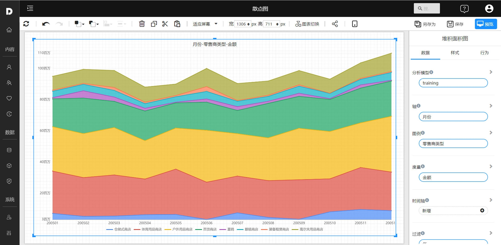

# 堆积面积图

堆叠面积图和基本面积图一样，唯一的区别就是图上每一个数据集的起点不同，起点是基于前一个数据集的，用于显示每个数值所占大小随时间或类别变化的趋势线，展示的是部分与整体的关系。

## 适用场景

- 系列比较和占比
- 时间趋势占比

## 组成

1. X 轴通常是时间，或是连续变化的量
2. Y 轴可以是数量，或成分占数据的百分比。
3. 不同的系列以面积图的形式表示，堆叠在一起。

## 示例

 

## 设置

| 设置内容       | 参考文档 |
| -------------- | -------- |
| 设置背景和边框 |          |
| 设置图例       |          |
|                |          |
