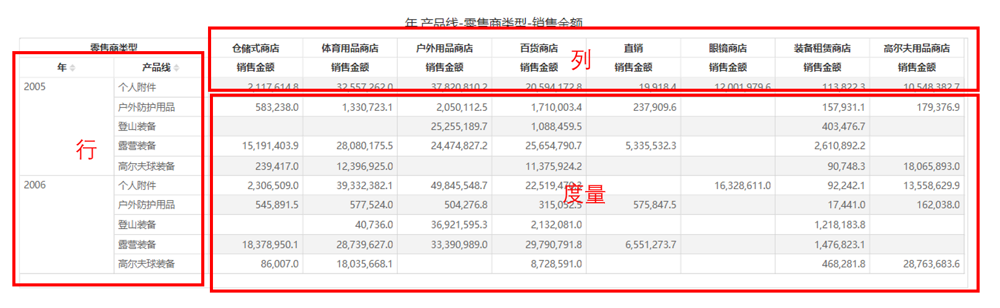

# 透视表

数据透视表（Pivot Table）是一种交互式的表，可以进行某些计算，如求和与计数等。所进行的计算与数据跟数据透视表中的排列有关。数据透视表可以动态地改变行和列交叉维度，以便按照不同的角度汇总分析数据。

## 适用场景

- 多维度、多指标交叉分析
- 数据分析报表

## 组成

1. 透视表由**行**、**列**、**度量**组成。

2. **行**，有一个或多个维度字段。

3. **列**，有一个或多个维度字段。

4. **度量**，有一个或多个度量字段组成。

   

## 制作透视表

1. **设置透视表数据**

   透视表由行、列、度量三个数据构成。

   

2. **合计和总计**

   透视表的行和列字段都可以设置合计汇总和总计汇总。

   样式面板中的”合计“和”总计“开关可以打开或关闭合计和总计行，并可以调整背景色、字体大小等样式属性。

   

3. **其它特性**

   - 行列排序
   - 下钻和过滤
