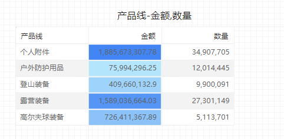
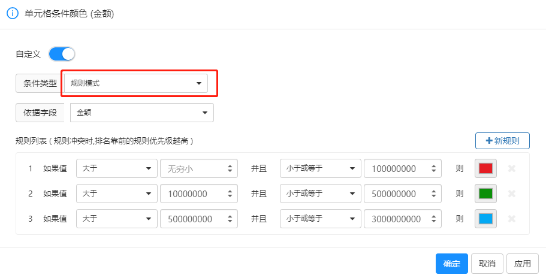
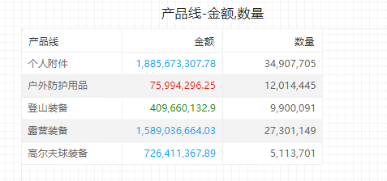

# 条件颜色设置

通过条件颜色设置，您可以根据指标值定义单元格背景色、单元格指标颜色、图表数据颜色。

## 设置背景或字体颜色

若要设置背景或字体颜色，请选择度量菜单中的”单元格字体条件颜色“或”单元格背景条件颜色“

“背景颜色”或“字体颜色”对话框将会打开，并在标题中显示正在进行格式设置的字段的名称 。 选择“启用”。

## 按色阶模式设置颜色

若要按色阶模式设置单元格背景或字体颜色，请在“背景颜色”或“字体颜色”的“条件类型”选择“色阶模式” 。 在“依据字段”下，选择要作为格式设置基础的字段。 可基于模型中其它度量字段设置格式。

在“最小值”和“最大值”下，选择自定义色卡值应用配色方案 。 

## 按规则模式设置颜色

若要按色阶模式设置单元格背景或字体颜色，请在“背景颜色”或“字体颜色”的“条件类型”选择“规则模式” 。 在“依据字段”下，选择要作为格式设置基础的字段。 可基于模型中其它度量字段设置格式。

在“规则列表”中，新建一个或多个值范围，并设置每个值范围的颜色。  单元格背景或每个值范围中的字体都以给定的颜色着色。

