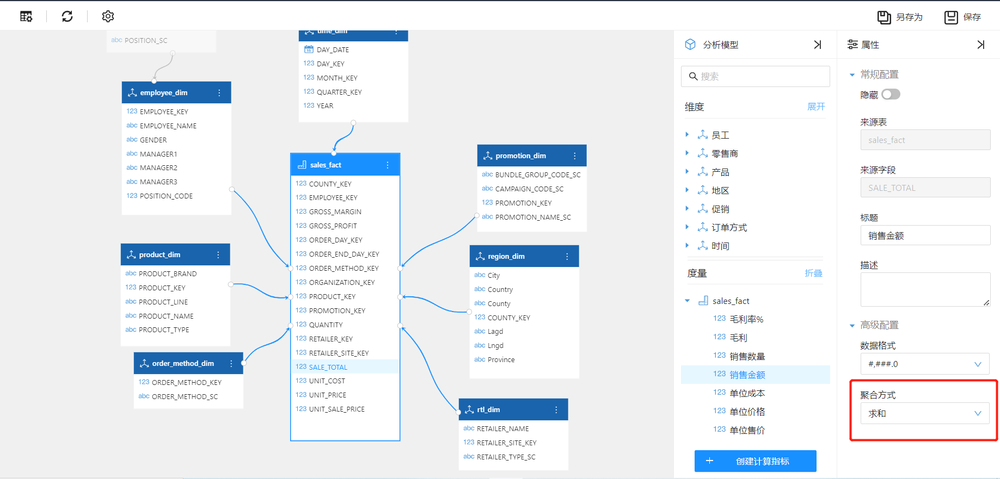
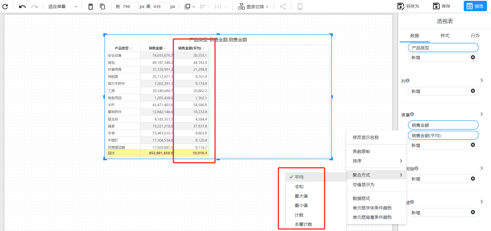

# 度量聚合

度量的聚合功能是指在数据分析过程中，将一个或多个度量进行汇总计算，以获得更有意义的数据洞察。常见的聚合函数包括平均值、求和、计数、最小值、最大值等。

## 设置度量的聚合方式

### 在分析模型上设置

分析模型中度量的默认聚合方式是“求和”。

1. 选中分析模型中需要修改聚合方式的度量。
2. 在属性面板中找到“聚合方式”，并修改度量的聚合方式。
3. 完成设置后，保存模型

### 在设置图表数据时设置

在度量字段的功能菜单中选择“聚合方式”菜单，并在子菜单中切换度量的聚合方式。

