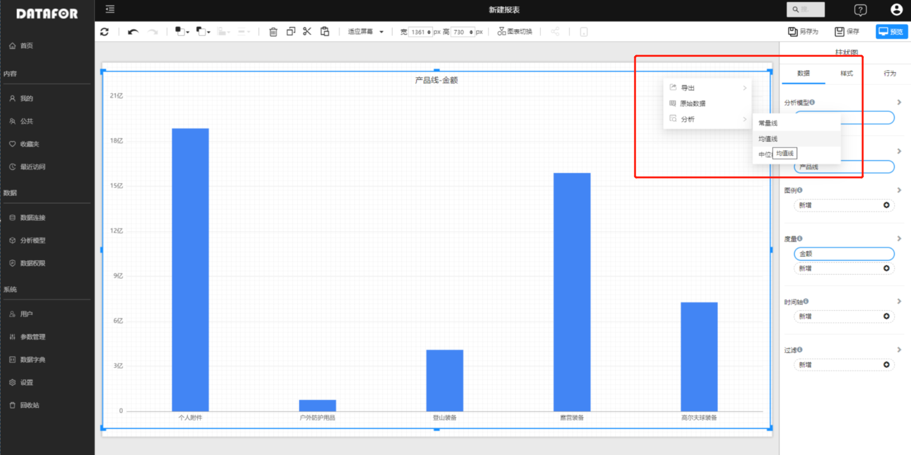
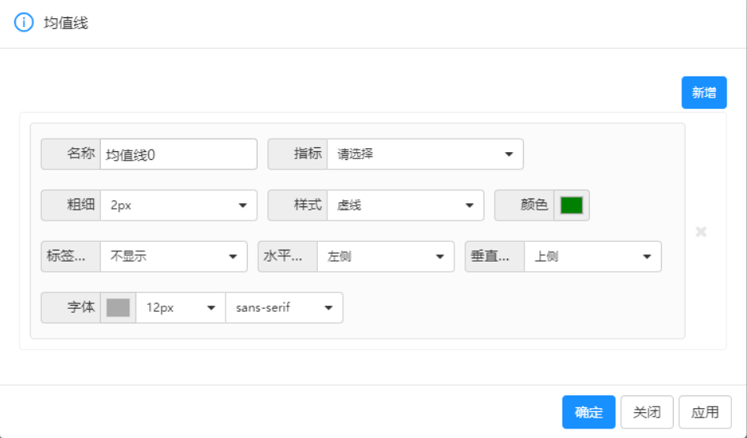
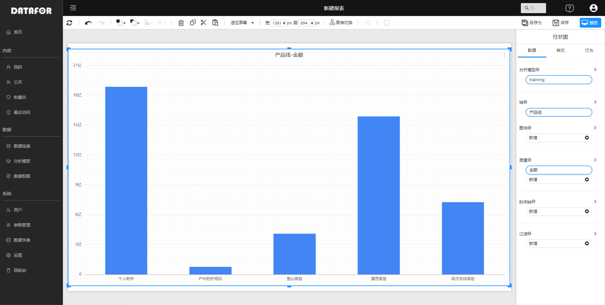
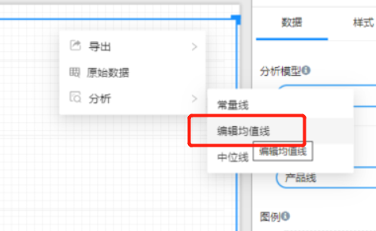

# 图表参考线

为了让数据更直观，有时候需要为图表添加一些参考线，例如常量线、均值线、中位线等。

## 支持图表参考线的图表

- 柱状图
- 条形图
- 折线图

## 如何设置参考线

1. 在组件菜单中选择“分析”菜单，在下级菜单中选择需要创建的参考线。

   

2. 点击”新增“按钮

   

3. 设置参考线

   

| 项目 | 描述                     |
| ---- | ------------------------ |
| 名称 | 参考线名称               |
| 指标 | 选择用哪个指标作为参考线 |
| 粗细 | 设置参考线粗细           |
| 样式 | 线条样式                 |
| 标签 | 是否显示标签             |
| 水平 | 标签水平位置             |
| 垂直 | 标签垂直位置             |
| 字体 | 标签字体和大小           |

## 删除参考线

1. 在组件菜单选择”编辑“需要删除的参考线

   

2. 点击参考先右侧的删除按钮

   