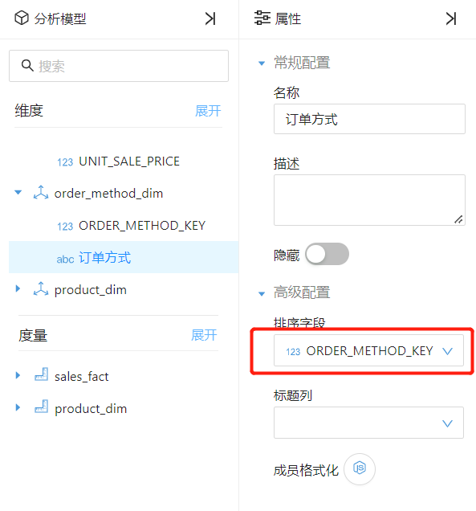
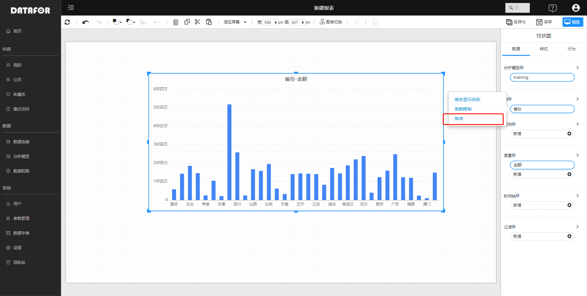
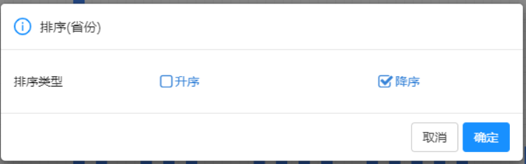
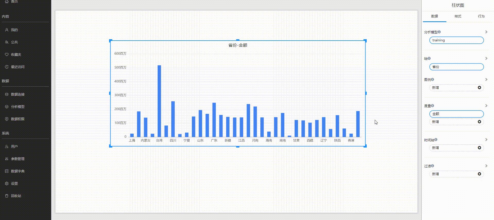

# 排序

## 分析模型上设置排序

当一个维度字段，它的排序顺序需要参考另外一个字段的顺序，那么你需要在设计模型时，在维度字段的”高级属性”中设置排序字段。

例如：你有一个“月份名称”列，当将其添加到某个组件后，月份会按字母顺序排序：四月、八月、十二月、二月等。 这不是你需要的， 你希望它们按时间顺序排序。

## 设计时排序

### 维度字段排序

组件的“轴”通常可以排序。无论是文本、数字还是日期，都可以按所需的方式进行排序。

对于某些类型的组件，排序不可用：树状图、仪表、地图等。

在维度字段的菜单中，选择“排序”类型，按确定按钮。

### 度量排序

度量值通常是数字类型，在度量菜单中选择“排序”，在排序对话框中选择排序类型。

