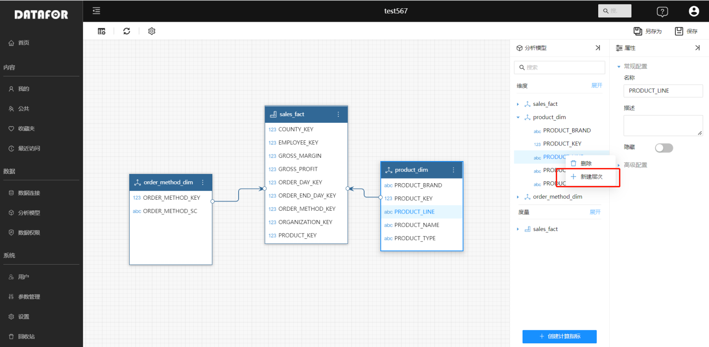
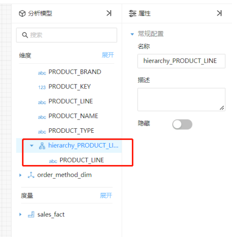
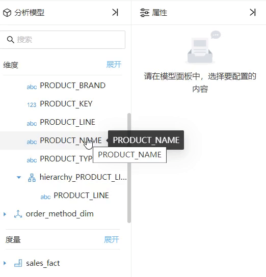
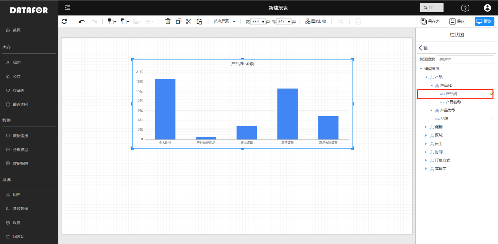
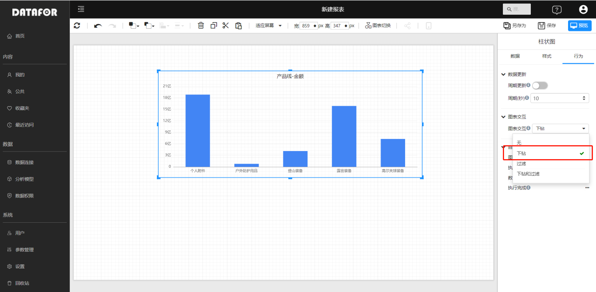
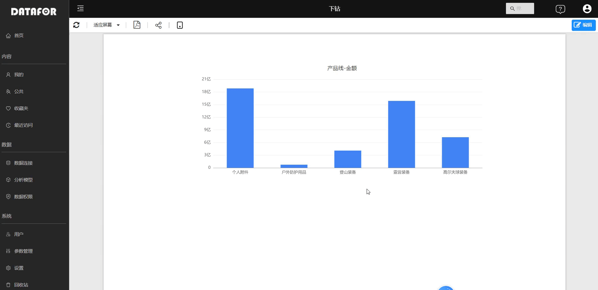

---
id: kzt-jmgnjs
title: 数据下钻
sidebar_position: 2
---
# 数据下钻

下钻可以理解成增加维的层次，从而可以**由粗粒度到细粒度来观察数据**，比如对产品销售情况分析时，可以沿着产品维从产品类别下钻到产品来观察数据。

## 在分析模型中创建层次（Hierarchy）

打开模型编辑界面。

在“分析模型”面板，右键维度字段，选择弹出菜单中的“新建层次”按钮。

在维度中创建了一个"层次"，右键选择的属性字段也会自动加入到这个“层次”中。

通过右侧的“属性”面板，可以修改“层次”的名称，或者隐藏“层次”

将其它字段拖动到此层次中，并通过拖动方式调整其位置。

层次自上而下，从高级别到低级别，最下层的最明细。

## 组件设置下钻行为

以柱状图为例，设置组件的下钻行为。

柱状图的“轴”字段，通常选择一个“层次”中相对更高级别的层次字段。

图中“产品线”这个层次有两个层，分别是“产品线”和“产品”。

在组件的“行为”面板中的“图表交互”下拉框中选择“下钻”。

预览页面可以使用下钻功能，从产品线下钻到产品，查看数据。

点击右上角组件菜单的“返回”按钮，组件从下钻层次的数据返回到下钻前数据。