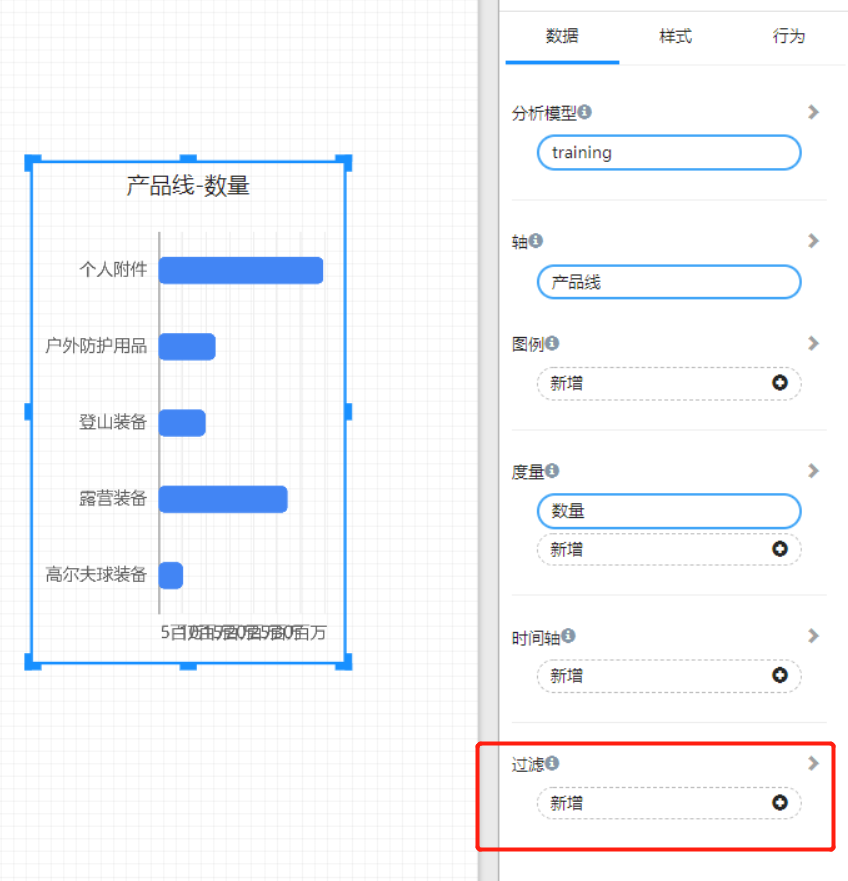
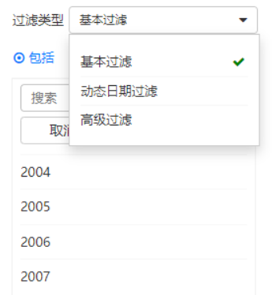
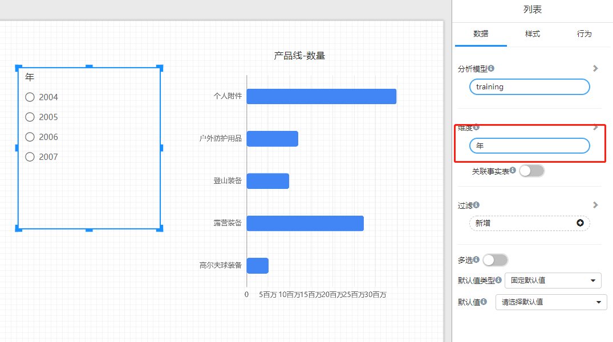
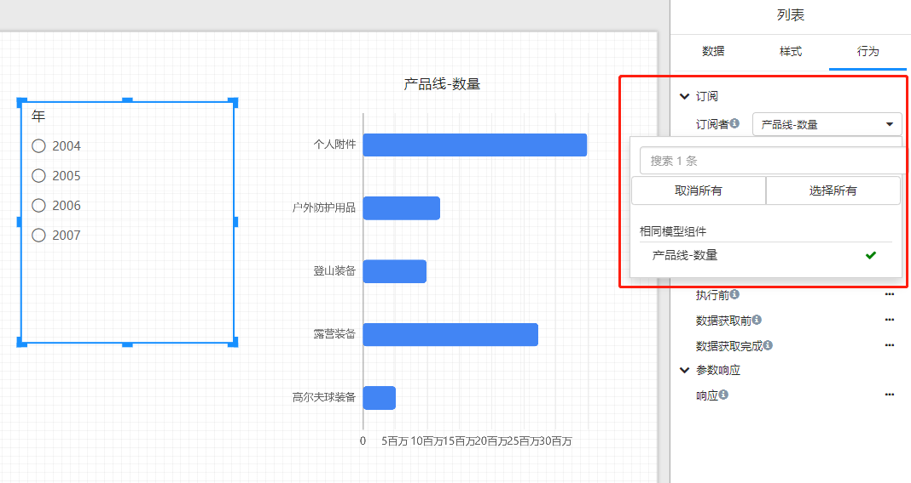
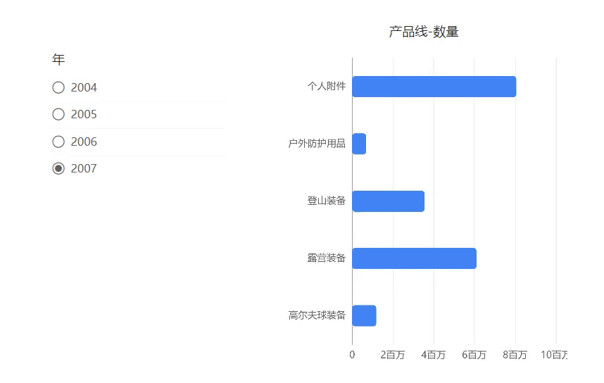
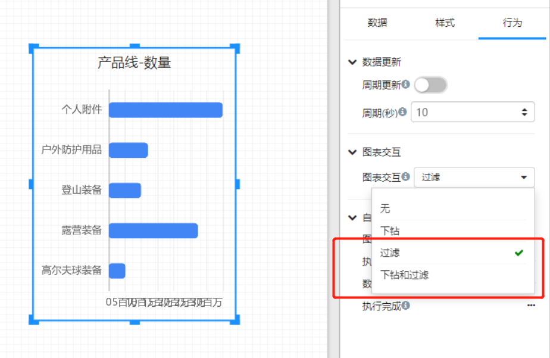
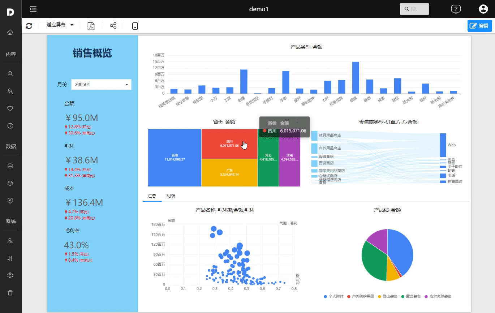

---
id: sjfx-sjdsxhgl
title: 数据的筛选和过滤
sidebar_position: 1
---
# 数据的筛选和过滤

## 概述

DTAFOR提供五种数据筛选过滤方法：

- 页面设计过程中，在数据面板中添加组件过滤条件。
- 通过页面中添加过滤组件，在查看页面时改变筛选组件的选中值过滤所订阅的组件数据。
- 通过设置组件的“过滤”行为，在查看页面时通过组件之间联动进行筛选和突出显示。
- 分析模型的SQL中使用参数，通过筛选组件影响参数值，实现SQL层数据过滤。
- 通过在 URL 中添加查询字符串参数来筛选报表

## 组件添加过滤

组件添加数据过滤是在分析报表设计时添加：

1. 选中页面上的组件，在数据面板添加“过滤”字段。

   

2. 设置过滤字段的值

   

3. 不同类型字段的过滤方法

    | 字段类型 | 过滤类型     | 过滤方法                                                     |
    | -------- | ------------ | ------------------------------------------------------------ |
    | 文本&emsp;&emsp;&emsp;  | 基本过滤&emsp;&emsp;&emsp;&emsp; | 包括或排除                                                   |
    |          | 高级过滤     | 包含、不包含、前置、后缀                                     |
    | 时间     | 基本过滤     | 包括或排除                                                   |
    |          | 动态日期过滤 | 选择动态日期，比如：今天、去年                               |
    |          | 高级过滤     | 之前(<=), 等于(=)，之后(>=)                                  |
    | 数字     |              |  小于、小于等于、等于、大于等于、大于、大于且小于、大于等于且小于、大于且小于等于、大于等于且小于等于、非空数据、空数据 |

## 过滤组件过滤其它组件

过滤组件用于过滤页面上其它组件显示的数据。

1. 选择适当的过滤组件，在画布上画出过滤器，并绑定需要过滤的维度字段。

   

2. 在过滤组件的”行为“面板，创建页面上其它组件和此过滤组件的订阅关系。有订阅关系的组件会被此过滤组件影响。

   

3. 预览页面，选择过滤组件中的值，订阅的组件数据就会跟着变化。

   

## 过滤与突出显示

组件的“过滤”行为，可突出显示你最关切的数据，并将突出显示数据相关的维度值传递到页面其它组件，对其它组件的数据进行过滤。

过滤条件对其它组件产生过滤作用需满足2个条件之一：
- 组件使用相同的模型
- 组件所使用的模型具有相同的维度

1. 在组件的“行为面板”上选择”过滤“或”下钻与过滤“

   

2. 预览页面，点击图表组件的图区位置

    

## 将参数传递到SQL进行筛选

## 在 URL 中添加查询字符串参数来筛选

报表的每一页都有自己的专属 URL，向 URL 添加查询字符串参数来预筛选报表。这种场景经常出现在报表页面嵌入到其它系统中，在其它系统中选择筛选条件后过滤报表页面。

