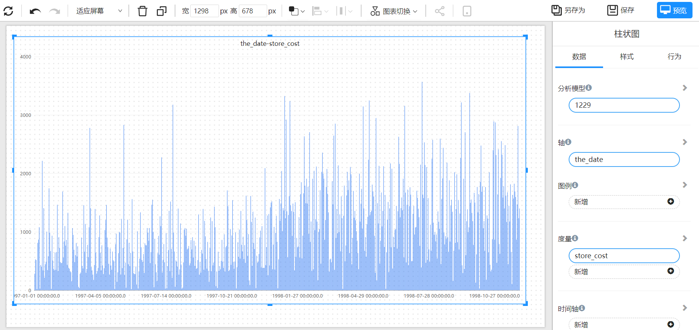
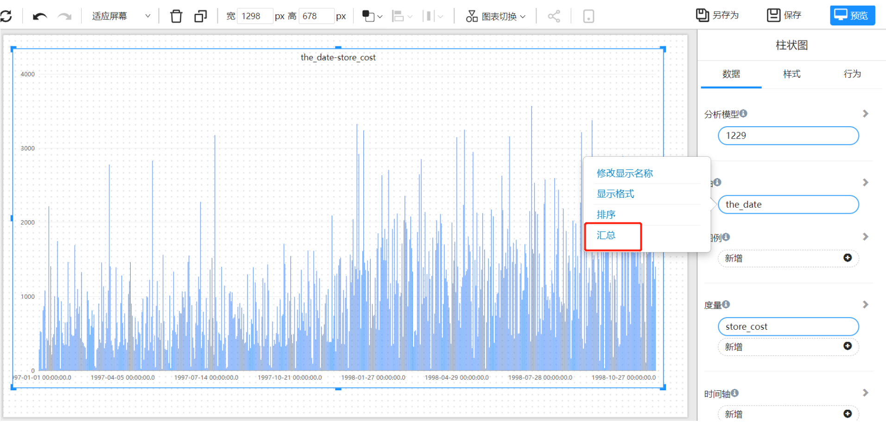
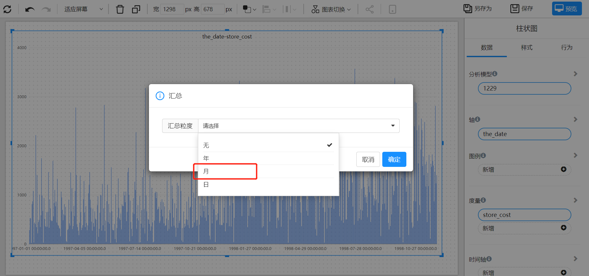
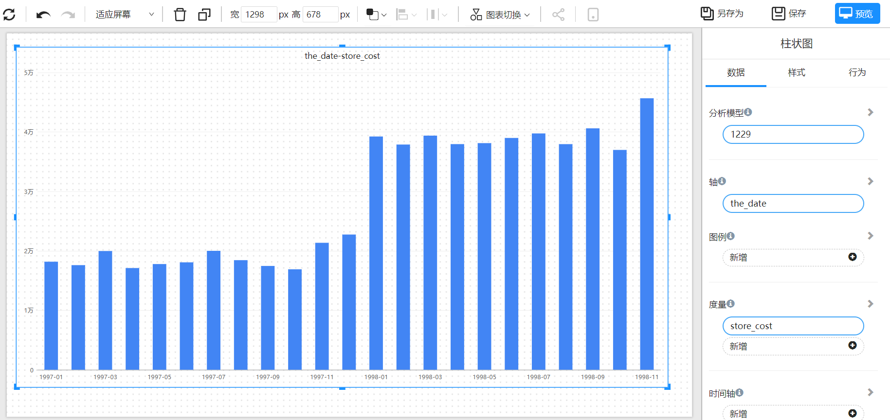

# 时间汇总

我们有“天”粒度的数据，如何汇总到“月”、“季度"或”年“？

## 两个方法：

1. 创建”时间维度“表，选择时间维度中的不同粒度时间字段进行汇总。
2. Datafor提供时间的汇总功能

## 例举：

我们有一个”天“粒度的数据，制作了一个柱状图。但是我们想看指标在月份粒度的比较。

 

选择字段操作菜单

 

选择汇总粒度

 

得到我们需要的粒度数据展示

 
