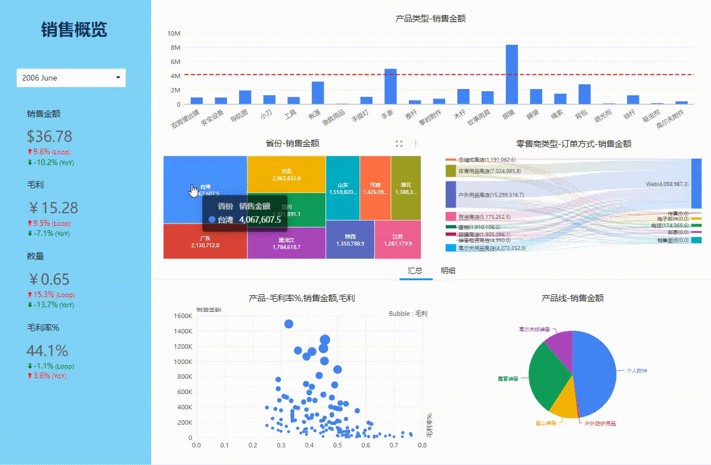
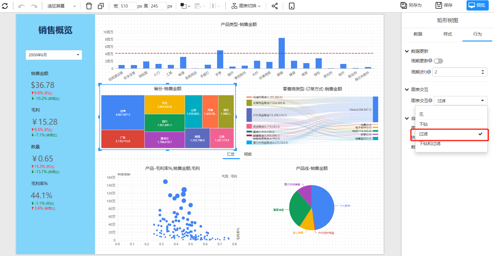

# 组件数据联动

组件数据联动工作原理是将组件的选中值传递到其它组件的筛选条件中。点击组件数据区域，组件选中区域会高亮显示，其它组件进行数据筛选并刷新数据。

   

## 如何设置联动

图表组件的行为面板的”图表交互“下拉框中选择”过滤“选项。![image-20230108161138610]   

## 常见问题

1. 不同分析模型的组件是否能联动？

   如果组件选中维度在不同的分析模型中都存在，那么选中维度值会被传递到不同的分析模型。所有不同分析模型的组件可以联动，但是需满足模型有相同的维度这个前提条件。

2. 图表组件是否会和筛选组件联动？

   图表组件和筛选组件没有联动功能。图表组件只能订阅筛选组件。

3. 筛选组件之间是否有联动功能

   筛选组件和筛选组件的联动通过”[筛选组件和图表组件的订阅]()“实现联动功能。