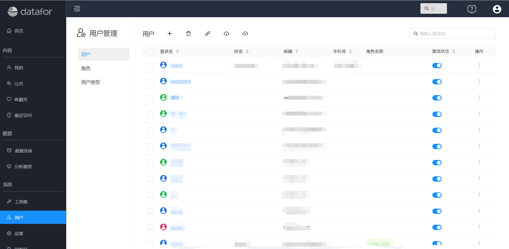
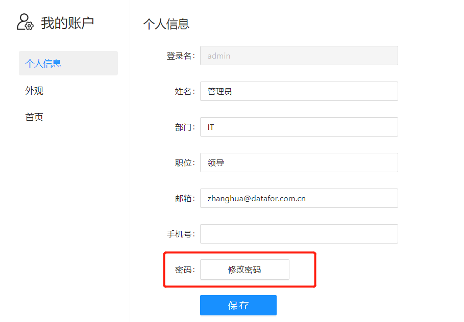
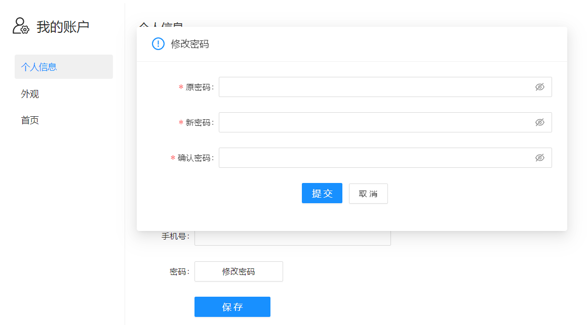
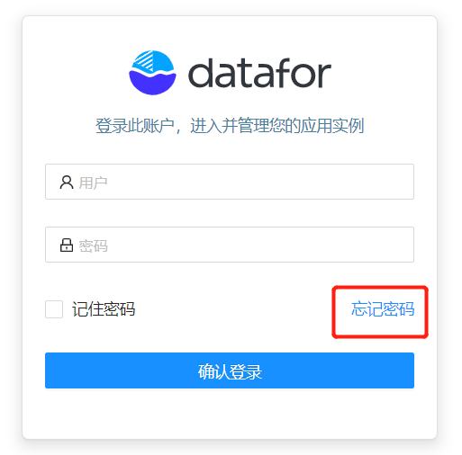
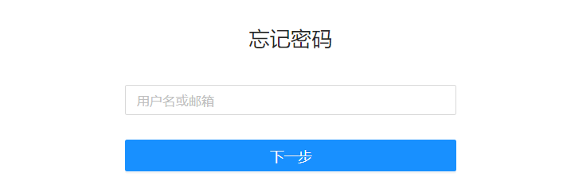

# 修改密码和找回密码

由于长时间不登录系统而忘记了密码，或由于密码泄露需要对密码进行修改，是用户经常会遇到的场景。下面我们介绍一下如何修改密码和找回密码。

## 修改密码

- **通过管理员修改密码**

  Datafor中的“超级管理员”和“管理员用户”都有权限修改用户的密码。

  1. 进入用户管理界面

     

  2. 点击用户“登录名”，在“密码”输入框中输入新的密码。

     

  

- **自己修改密码**

  进入“我的账户”管理界面

  

输入原密码和新密码

## 找回密码

> 使用找回密码功能有两个前置条件：
> 1. 系统配置了邮箱服务器信息
> 2. 用户信息中设置了用户的邮箱地址

1. 在登录系统页面点击“忘记密码”

   

2. 输入用户邮箱或登录名

   

3. 检查Datafor发送验证码的邮件

   

4. 输入验证码和设置新的密码

   

5. 完成密码设置，重新登录系统

   

