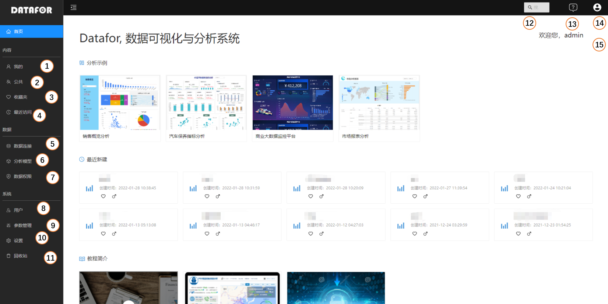
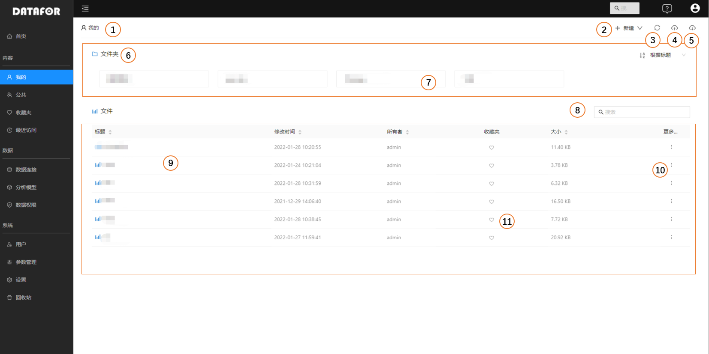
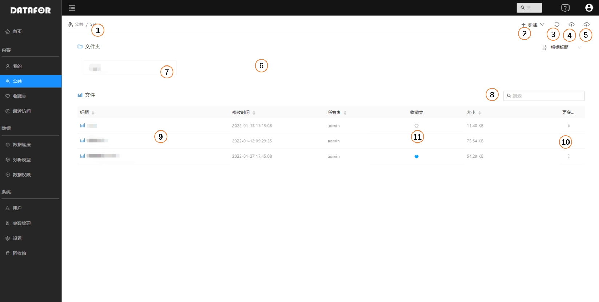
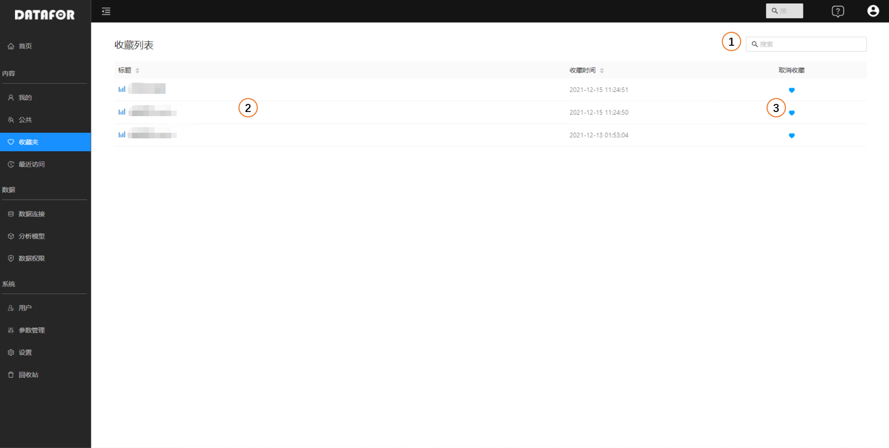
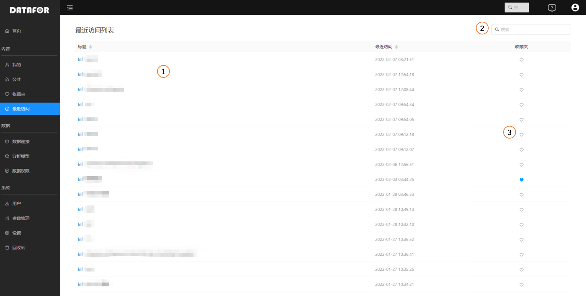
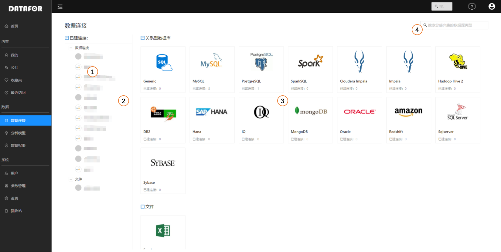
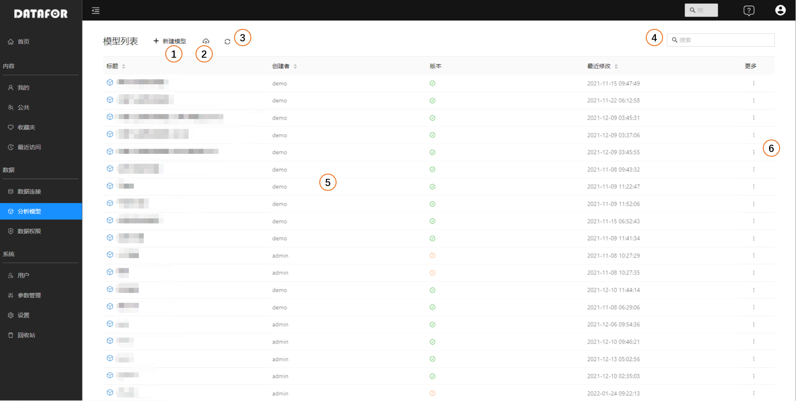
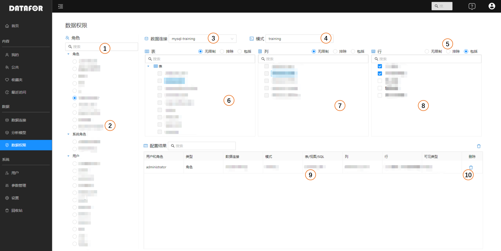
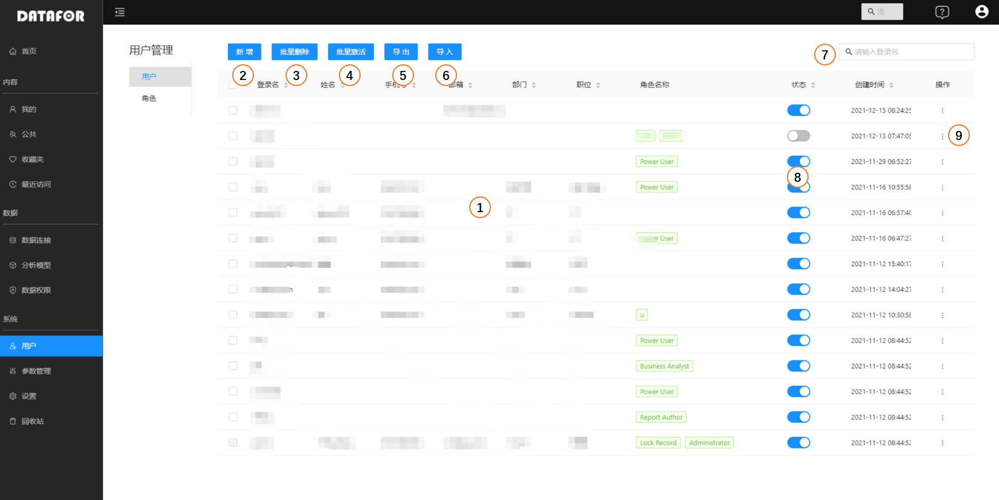
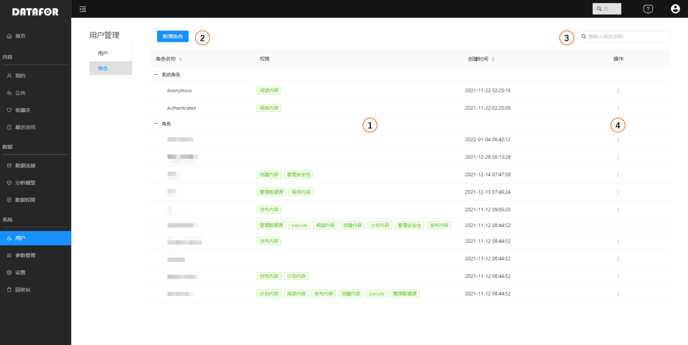

---
id: kzt-jmgnjs
title: 控制台功能概览
sidebar_position: 1
---
# 控制台功能概览

下面是DATAFOR 4.0的控制台功能概览。

## 控制台

DATAFOR控制台是一个基于Web的管理界面，您可以在其中创建您的数据分析文件，并管理和分享您的文件。同时，控制台还提供了多种用于配置DATAFOR服务的系统管理功能。

1. **首页**：在首页上可以看到示例页面、最近新建页面和DATAFOR简介入口。
2. **我的**：存放和管理私有的目录和文件，此文件夹中的内容只有登录用户可见，其他用户不可见。
3. **公共**：存放和管理公共目的录和文件，此文件夹中的内容可以设置不同的权限给不同用户和角色。
4. **收藏夹**：存放和管理收藏文件。
5. **最近访问**：存放最近访问过的文件。
6. **数据连接**：管理数据源，包括数据库和文件数据源。
7. **分析模型**：管理多维分析模型。
8. **用户**：管理用户和角色。
9. **参数管理**：管理全局参数。
10. **设置**：系统级别的设置。
11. **回收站**：删除的文件和文件夹内容。
12. **搜索**：全局搜索，包括：文件、文件夹、分析模型、数据连接。
13. **帮助**：跳转到帮助网站。
14. **注销**：注销系统。
15. **我的账户**：我的账户管理和个性化设置。

### 我的

“**我的**”文件夹是用来存放私有目录和文件的地方，此文件夹中的内容不允许授权给其他人访问。

1. **目录导航**：切换目录
1. **新建**：新建文件夹或文件
2. **刷新**：重新加载文件夹和文件列表内容
3. **上传**：上传文件
4. **下载**：下载此文件夹下的所有文件夹和文件内容
5. **文件夹**：文件夹列表
6. **文件夹操作菜单**：重命名、删除、下载
7. **搜索**：搜索文件
8. **文件**：文件列表
9. **文件操作菜单**：编辑、新窗口打开、新窗口（无工具栏）、重命名、删除、下载、复制、移动
9. **收藏夹**：加入收藏夹或从收藏夹移除

### 公共

“**公共**”文件夹中的目录和文件可以通过授权方式，让不同的角色和用户访问，并且授予不同的权限。

1. **目录导航**：切换目录
2. **新建**：新建文件夹或文件
3. **刷新**：重新加载文件夹和文件列表内容
4. **上传**：上传文件
5. **下载**：下载此文件夹下的所有文件夹和文件内容
6. **文件夹**：文件夹列表
7. **文件夹操作菜单**：重命名、删除、下载、权限、复制权限
8. **搜索**：搜索文件
9. **文件**：文件列表
10. **文件操作菜单**：编辑、新窗口打开、新窗口（无工具栏）、重命名、删除、下载、复制、移动、权限、复制权限
11. **收藏夹**：加入收藏夹或从收藏夹移除

### 收藏夹

“**收藏夹**”文件夹中收藏您经常需要访问的文件。

1. **搜索**：搜索收藏夹中的文件
2. **收藏列表**：收藏文件列表
3. **取消收藏**：将文件从收藏夹移除

### 最近访问

“**最近访问**”文件夹中存放最近访问过的文件列表

1. **最近访问列表**：最近访问过的文件列表
2. **搜索**：搜索最近访问的文件
3. **收藏夹**：加入收藏夹或从收藏夹移除

### 数据连接

“**数据连接**”，用来管理数据库的连接和文件上传。

1. **已建连接**：已建的数据库连接清单
2. **数据连接操作菜单**：删除、新建分析模型
3. **数据源类型列表**：可用连接的数据源类型
4. **搜索**：搜索已建的数据连接

### 分析模型

”**分析模型**“，管理分析模型。

1. **新建模型**：创建新的分析模型
2. **上传**：上传分析模型
3. **刷新**：刷新分析模型列表
4. **搜索**：搜索分析模型
5. **模型列表**：分析模型列表
6. **更多**：分析模型操作菜单，包括：新建文件、重命名、删除、复制、下载、更换连接、权限设置、复制权限

### 数据权限

”**数据权限**“，配置角色和用的数据访问权限。

1. **搜索**：搜索用户或角色
2. **用户和系统角色**、业务角色清单
3. **数据连接**：选择设置权限的数据连
4. **模式**：如果连接的数据库有多个模式，这里选择模式
5. **权限控制开关**：无限制、排除、包括
6. **表**：模式下所有的表和视图清单
7. **行**：选中表的字段清单
8. **行**：选中字段的记录内容
9. **配置结果**：配置的结果清单
10. **删除**：删除配置的结果

#### 用户管理

管理用户和角色信息。

#### 用户

管理用户和角色

1. **用户列表**：显示所有用户
2. **新增**：创建新用户
3. **批量删除**：删除用户
4. **批量激活**：激活用户
5. **导出**：将用户信息导出到Excel文件
6. **导入**：从Excel文件将用户导入到系统
7. **搜索**：搜索用户
8. **状态开关**：激活状态设置
9. **操作菜单**：修改、删除、目录文件权限、复制权限、分析模型权限、设置角色

#### 角色

管理系统角色和业务角色

1. **角色列表**：系统角色和业务角色列表
2. **新增角色**：创建新的业务角色
3. **搜索**：搜索用户或角色
4. **操作菜单**：分配权限、目录文件权限、复制权限、删除
