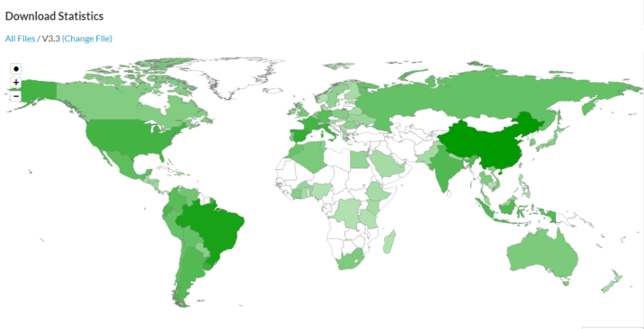

---
sidebar_position: 1
description: 这是一个帮助文档。
keywords:
  [
    datafor,
    文档
  ]
slug: /
id: intro
title: 欢迎
---

# DATAFOR数据可视化与分析平台

Datafor数据可视化与分析平台可以帮您轻松进行探索式数据分析，将枯燥的数据变得直观、生动、便于理解，协助您理解业务、发现问题、找到原因，为进一步的决策提供依据。

> 🚀**本文档持续更新中...**

## 最近更新

**2022年1月：版本4.0**

新增功能：

1. 引入server端参数机制，通过参数过滤数据
2. 图表标题和图区分离
3. 支持参数控制标签页组件
4. 图库升级至echarts5.2
5. 编辑模式下允许透视表、表格组件滚动
6. 升级颜色选择器组件
7. 图表组件工具栏升级
8. 支持配置图表放大后的背景颜色
9. 优化图表输出关联条件功能，点击过滤不再重查数据
10. 引入滚动加载透视表，优化复杂表格查询性能
11. 支持div方式集成报表工具
