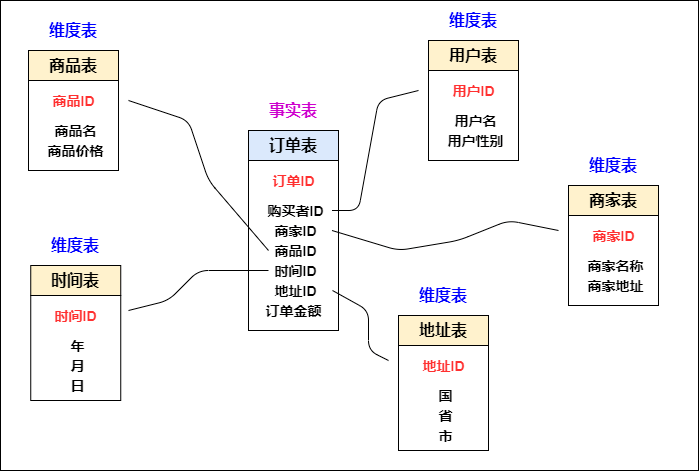
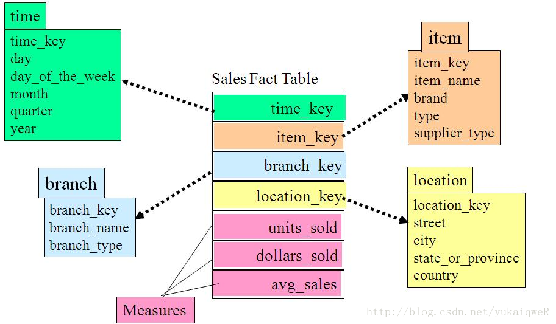
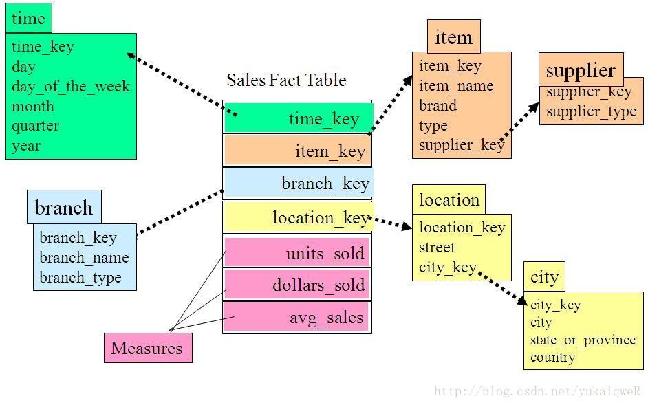
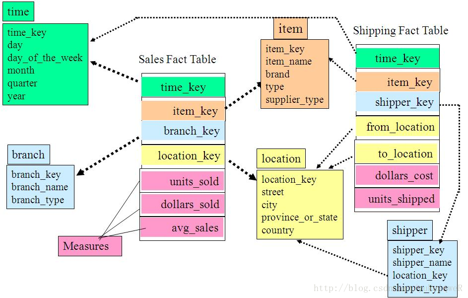
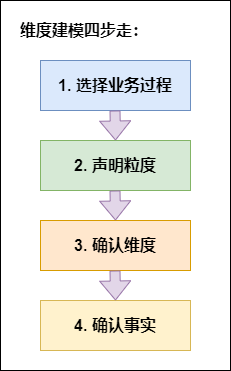

---
id: fxmx-fxmxgs
title: 分析模型概述
sidebar_position: 1
---
# 分析模型概述

> 本文部分引用于五分钟学大数据 ，作者园陌

DATAFOR分析模型采用多维数据模型。多维数据模型是为了满足用户从多角度多层次进行数据查询和分析的需要而建立起来的基于事实和维的数据库模型。DATAFOR通过多维数据模型的查询，进行多维数据分析和数据展示。

## 维度建模中表的类型
维度建模分为两种表：事实表和维度表：

- **事实表**：必然存在的一些数据，像采集的日志文件，订单表，都可以作为事实表。
  				特征：是一堆主键的集合，每个主键对应维度表中的一条记录， 客观存在的，根据主题确定出	需要使用的数据。
- **维度表**：维度就是所分析的数据的一个量，维度表就是以合适的角度来创建的表，分析问题的一个角度：时间、地域、终端、用户等角度。

### 事实表

发生在现实世界中的操作型事件，其所产生的可度量数值，存储在事实表中。从最低的粒度级别来看，事实表行对应一个度量事件，反之亦然。
​事实表表示对分析主题的度量。比如一次购买行为我们就可以理解为是一个事实。

图中的订单表就是一个事实表，你可以理解他就是在现实中发生的一次操作型事件，我们每完成一个订单，就会在订单中增加一条记录。事实表的特征：表里没有存放实际的内容，他是一堆主键的集合，这些ID分别能对应到维度表中的一条记录。事实表包含了与各维度表相关联的外键，可与维度表关联。事实表的度量通常是数值类型，且记录数会不断增加，表数据规模迅速增长。

**事实表种类**

事实表分为以下6类：
1. 事务事实表
	表中的一行对应空间或时间上某点的度量事件。就是一行数据中必须有度量字段，什么是度量，就是指标，比如说销售金额，销售数量等这些可加的或者半可加就是度量值。另一点就是事务事实表都包含一个与维度表关联的外键。并且度量值必须和事务粒度保持一致。
2. 周期快照事实表
	顾名思义，周期事实表就是每行都带有时间值字段，代表周期，通常时间值都是标准周期，如某一天，某周，某月等。粒度是周期，而不是个体的事务，也就是说一个周期快照事实表中数据可以是多个事实，但是它们都属于某个周期内。
3. 累计快照事实表
	周期快照事实表是单个周期内数据，而累计快照事实表是由多个周期数据组成，每行汇总了过程开始到结束之间的度量。每行数据相当于管道或工作流，有事件的起点，过程，终点，并且每个关键步骤都包含日期字段。如订单数据，累计快照事实表的一行就是一个订单，当订单产生时插入一行，当订单发生变化时，这行就被修改。
4. 无事实的事实表
	我们以上讨论的事实表度量都是数字化的，当然实际应用中绝大多数都是数字化的度量，但是也可能会有少量的没有数字化的值但是还很有价值的字段，无事实的事实表就是为这种数据准备的，利用这种事实表可以分析发生了什么。
5. 聚集事实表
	聚集，就是对原子粒度的数据进行简单的聚合操作，目的就是为了提高查询性能。如我们需求是查询全国所有门店的总销售额，我们原子粒度的事实表中每行是每个分店每个商品的销售额，聚集事实表就可以先聚合每个分店的总销售额，这样汇总所有门店的销售额时计算的数据量就会小很多。
6. 合并事实表
	这种事实表遵循一个原则，就是相同粒度，数据可以来自多个过程，但是只要它们属于相同粒度，就可以合并为一个事实表，这类事实表特别适合经常需要共同分析的多过程度量。

### 维度表

每个维度表都包含单一的主键列。维度表的主键可以作为与之关联的任何事实表的外键，当然，维度表行的描述环境应与事实表行完全对应。维度表通常比较宽，是扁平型非规范表，包含大量的低粒度的文本属性。	
维度表示你要对数据进行分析时所用的一个量，比如你要分析产品销售情况， 你可以选择按类别来进行分析，或按区域来分析。每个类别就构成一个维度。上图中的用户表、商家表、时间表这些都属于维度表，这些表都有一个唯一的主键，然后在表中存放了详细的数据信息。

总的说来，在数据仓库中不需要严格遵守规范化设计原则。因为数据仓库的主导功能就是面向分析，以查询为主，不涉及数据更新操作。**事实表的设计是以能够正确记录历史信息为准则，维度表的设计是以能够以合适的角度来聚合主题内容为准则**。

**维度表结构**
维度表谨记一条原则，包含单一主键列，但有时因业务复杂，也可能出现联合主键，请尽量避免，如果无法避免，也要确保必须是单一的，这很重要，如果维表主键不是单一，和事实表关联时会出现数据发散，导致最后结果可能出现错误。
维度表通常比较宽，包含大量的低粒度的文本属性。

**跨表钻取**

跨表钻取意思是当每个查询的行头都包含相同的一致性属性时，使不同的查询能够针对两个或更多的事实表进行查询
钻取可以改变维的层次，变换分析的粒度。它包括上卷/下钻：

 - 上卷（roll-up）：上卷是沿着维的层次向上聚集汇总数据。例如，对产品销售数据，沿着时间维上卷，可以求出所有产品在所有地区每月（或季度或年或全部）的销售额。
 - 下钻（drill-down）：下钻是上钻的逆操作，它是沿着维的层次向下，查看更详细的数据。

**退化维度**
退化维度就是将维度退回到事实表中。因为有时维度除了主键没有其他内容，虽然也是合法维度键，但是一般都会退回到事实表中，减少关联次数，提高查询性能

**多层次维度**
多数维度包含不止一个自然层次，如日期维度可以从天的层次到周到月到年的层次。所以在有些情况下，在同一维度中存在不同的层次。

**维度表空值属性**
当给定维度行没有被全部填充时，或者当存在属性没有被应用到所有维度行时，将产生空值维度属性。上述两种情况，推荐采用描述性字符串代替空值，如使用 unknown 或 not applicable 替换空值。

**日历日期维度**
在日期维度表中，主键的设置不要使用顺序生成的id来表示，可以使用更有意义的数据表示，比如将年月日合并起来表示，即YYYYMMDD，或者更加详细的精度。

## 多维模型的三种模式

常见的基于关系型数据库的多维分析模型有：星形模式、雪花模式、事实星座模式。

- 星形模型

  星形模式(Star Schema)是最常用的维度建模方式。**星型模式是以事实表为中心，所有的维度表直接连接在事实表上，像星星一样**。星形模式的维度建模由一个事实表和一组维表成，且具有以下特点：

  ​	a. 维表只和事实表关联，维表之间没有关联；

  ​	b. 每个维表主键为单列，且该主键放置在事实表中，作为两边连接的外键；

  ​	c. 以事实表为核心，维表围绕核心呈星形分布。

  星型模式示例如下所示：

	       
		星型：一种非正规化的结构，多维数据集的每一个维度都直接与事实表相连接，不存在渐变维度，所以数据有一定的冗余。

- 雪花模型

  雪花模式(Snowflake Schema)是对星形模式的扩展。**雪花模式的维度表可以拥有其他维度表的**，虽然这种模型相比星型更规范一些，但是由于这种模型不太容易理解，维护成本比较高，而且性能方面需要关联多层维表，性能也比星型模型要低。所以一般不是很常用。雪花模式示例如下图所示：

	  

原有的各维表可能被扩展为小的事实表，形成一些局部的 “层次 ” 区域，这些被分解的表都连接到主维度表而不是事实表，通过最大限度地减少数据存储量以及联合较小的维表来改善查询性能。雪花型结构去除了数据冗余。从图中我们可以看到地址表被进一步细分出了城市（city）维。supplier_type表被进一步细分出来supplier维。

- 事实星座模式

  星座模式是星型模式延伸而来，星型模式是基于一张事实表的，而**星座模式是基于多张事实表的，而且共享维度信息**。前面介绍的两种维度建模方法都是多维表对应单事实表，但在很多时候维度空间内的事实表不止一个，而一个维表也可能被多个事实表用到。在**业务发展后期，绝大部分维度建模都采用的是星座模式**。本模式示例如下图所示：

 	 

如上图所示，事实星座模式包含两个事实表：sales和shipping，二者共享维表。

## 建模过程

我们知道维度建模的表类型有事实表，维度表；模式有星形模型，雪花模型，星座模型这些概念了，但是实际业务中，给了我们一堆数据，我们怎么拿这些数据进行数仓建设呢，数仓工具箱作者根据自身60多年的实际业务经验，给我们总结了如下四步：

 

1. 选择业务过程

   维度建模是紧贴业务的，所以必须以业务为根基进行建模，那么选择业务过程，顾名思义就是在整个业务流程中选取我们需要建模的业务，根据运营提供的需求及日后的易扩展性等进行选择业务。比如商城，整个商城流程分为商家端，用户端，平台端，运营需求是总订单量，订单人数，及用户的购买情况等，我们选择业务过程就选择用户端的数据，商家及平台端暂不考虑。业务选择非常重要，因为后面所有的步骤都是基于此业务数据展开的。

2. 声明粒度

   先举个例子：对于用户来说，一个用户有一个身份证号，一个户籍地址，多个手机号，多张银行卡，那么与用户粒度相同的粒度属性有身份证粒度，户籍地址粒度，比用户粒度更细的粒度有手机号粒度，银行卡粒度，存在一对一的关系就是相同粒度。为什么要提相同粒度呢，因为维度建模中要求我们，在**同一事实表**中，必须具有**相同的粒度**，同一事实表中不要混用多种不同的粒度，不同的粒度数据建立不同的事实表。并且从给定的业务过程获取数据时，强烈建议从关注原子粒度开始设计，也就是从最细粒度开始，因为原子粒度能够承受无法预期的用户查询。但是上卷汇总粒度对查询性能的提升很重要的，所以对于有明确需求的数据，我们建立针对需求的上卷汇总粒度，对需求不明朗的数据我们建立原子粒度。

3. 确认维度

   维度表是作为业务分析的入口和描述性标识，所以也被称为数据仓库的“灵魂”。在一堆的数据中怎么确认哪些是维度属性呢，如果该列是对具体值的描述，是一个文本或常量，某一约束和行标识的参与者，此时该属性往往是维度属性，数仓工具箱中告诉我们**牢牢掌握事实表的粒度，就能将所有可能存在的维度区分开**，并且要**确保维度表中不能出现重复数据，应使维度主键唯一。**

4. 确认事实
   事实表是用来度量的，基本上都以数量值表示，事实表中的每行对应一个度量，每行中的数据是一个特定级别的细节数据，称为粒度。维度建模的核心原则之一是同一事实表中的所有度量必须具有相同的粒度。这样能确保不会出现重复计算度量的问题。有时候往往不能确定该列数据是事实属性还是维度属性。记住最实用的事实就是数值类型和可加类事实。所以可以通过分析该列是否是一种包含多个值并作为计算的参与者的度量，这种情况下该列往往是事实。

## 多维模型的意义

多维数据模型**能使数据建模更加简单**，因为开发人员能够方便地用它来描述出复杂的现实世界结构，而不必忽略现实世界的问题，或把问题强行表现成技术上能够处理的形态，而且多维数据模型使执行复杂处理的时间大大缩短。

