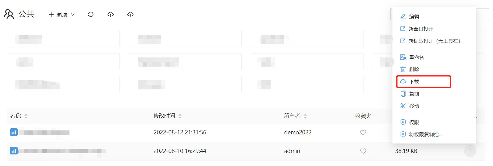

# 资源迁移

项目部署环境一般可分为三种：生产环境，测试环境，开发环境。
Datafor提供了报表、文件夹、模型等资源的“下载”和“上传”方法，使得系统之间的资源迁移变得非常方便和灵活。

## 报表文件和文件夹迁移

1. 在报表文件或文件夹的操作菜单中，选择“下载”菜单。

   

   > 文件夹下载的压缩包中包含当前文件夹和所有子文件夹中的文件和文件夹。

2. 打开目标系统的文件夹，点击“上传”按钮。

   

3. 选择从源系统下载下来的报表文件。

   

4. 点击“保存”按钮，文件上传到目标系统的文件夹

   

## 分析模型迁移

1. 在分析模型列表操作菜单中选择“下载”菜单。

   

2. 在目标系统的分析模型列表工具栏上选择“上传”按钮。

   

3. 选择模型文件和设置“数据连接”

   

4. 点击“确定”按钮，上传成功。

