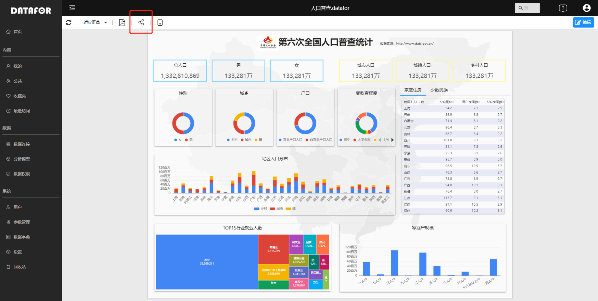
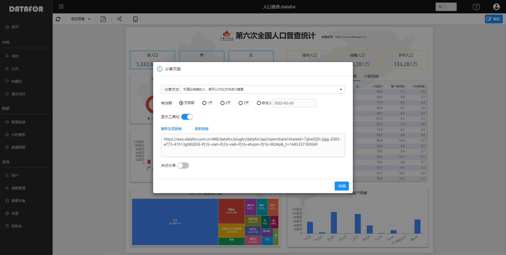
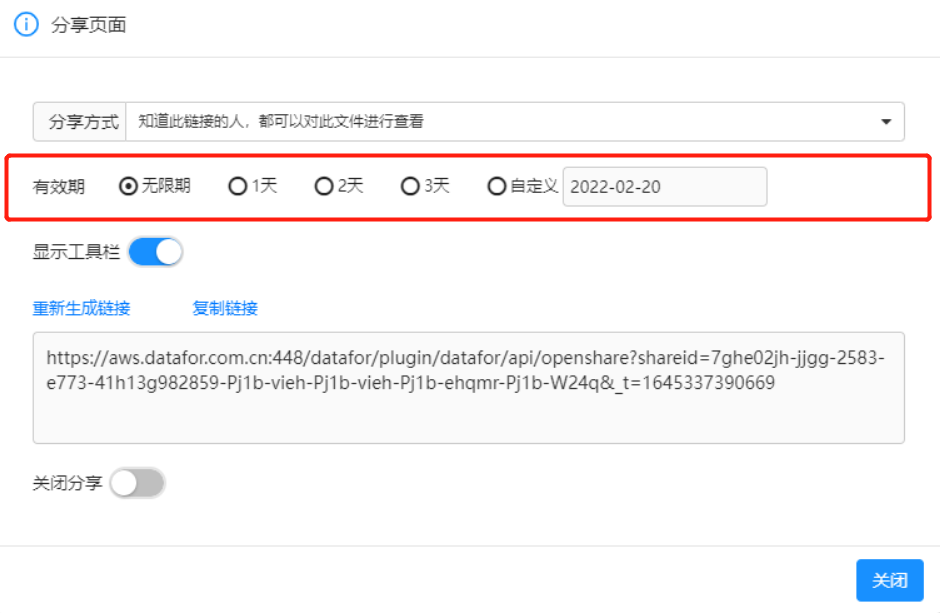

# 分享链接

通过生成“分享链接”，可以将分析报表分享给他人。被分享者有DATAFOR账号或者没有DATAFOR账号，都可以查看数据，或者修改报表。

预览或者编辑页面过程中都可以分享页面。

点击工具栏上“分享”按钮，在分享页面弹出框中可以生成分享链接。

## 分享链接的设置

### 分享方式

DATAFOR提供三种分享链接：

- 知道此链接的人，都可以对此文件进行查看。

  任何人，都可以访问此链接来查看此报表，无需DATAFOR账号。数据权限和分享者的权限一致。

- 知道此链接的人，都可以对此文件进行编辑。

  任何人，都可以访问此链接来编辑和查看此报表，无需DATAFOR账号。数据权限和分享者的权限一致。

- 特定的人可以访问（需登录）

  需要登录到DATAFOR系统才能访问此链接，并且数据权限和登录用户的数据权限一致。

***注意：对文件没有编辑权限的用户，也无权生成“知道此链接的人，都可以对此文件进行编辑。”的分享链接。**

### 有效期

有效期是指生成的分享链接的有效期，超过有效期，链接失效。

### 显示工具栏

此开关设置，通过分享链接打开页面是否允许显示“工具栏”

