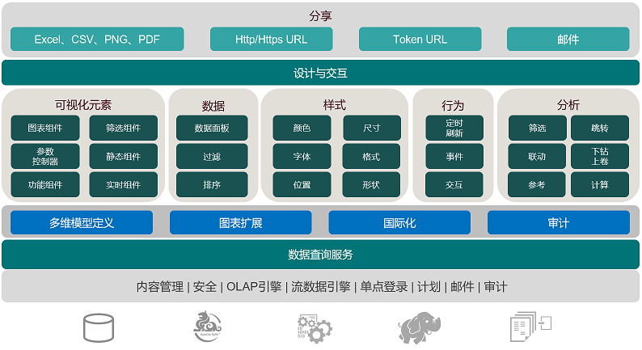
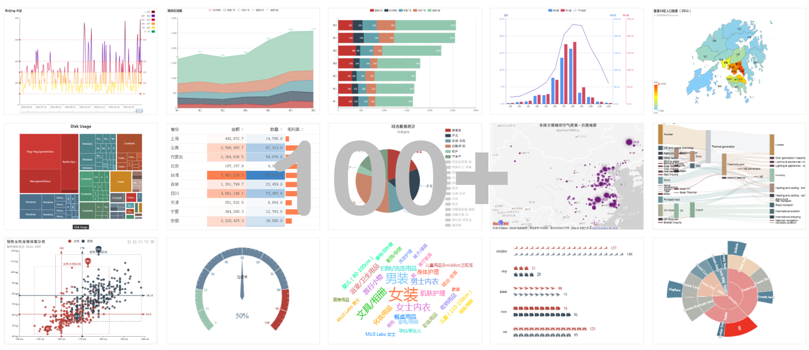
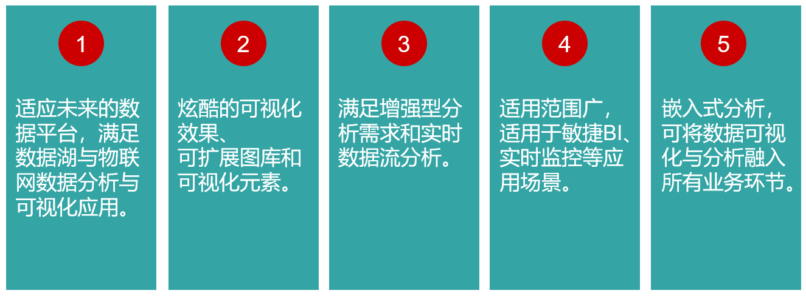

---
id: cpjj-cpjs
title: 产品简介
sidebar_position: 1
---
# 产品简介

## 概述

DATAFOR是上海数为公司推出的一款数据可视化与分析产品。DATAFOR提供丰富的数据可视化元素，强大的个性化设置，简单的交互设计，帮助用户对数据进行探索式多维分析，制作出精美的数据分析报告和数据可视化界面并分享数据价值。

### 有哪些应用场景

- 自助式日常数据分析
- 报表、仪表盘、数字化报告
- 数字大屏展示
- 实时数据监控
- 适应手机布局的仪表盘
- 嵌入式分析和可视化

## 优势

### 先进的架构

- 完整性：拥有中心资源库、审计组件、查询引擎、加密管道，内容管理等功能。
- 高伸缩性：多租户架构，提供不同规模的企业应用。
- 开放架构：轻量级，模块化，可插拔。
- 数据源、可视化元素扩展方案支持

### 炫酷的可视化元素

DATAFOR支持丰富的图表组件（100+种：表格、折线图、柱状图、饼图、面积图、GIS地图、散点图等等）和过辅助（10+种：单选、多选、日期、输入框、复杂逻辑等），充分满足复杂的可视化需求。

### 强大的多维分析能力

- **钻取**：改变维的层次，变换分析的粒度。
- **筛选**：组件级、页面级，筛选方式包括：列表选择、范围、通配比较、相对比较等。
- **对比**：长度、大小、面积的对比。
- **趋势**：通过趋势分析，了解变化。
- **关联**：发现存在于大量数据集中的关联性或相关性。
- **排序**：将“无序”的调整为“有序”。
- **计算**：创建新的计算指标和计算成员。
- **汇总**：包括累加、平均、计数、最小、最大等统计。

### 企业级权限管控

企业的数据分析报表通常需要进行权限控制，根据报表使用者的角色，决定他可以看到的数据。例如，A角色的人只能查看A部门的数据，B角色的人只能查看B部门的数据，而领导层则可以看到所有的数据。DATAFOR支持对角色设置数据访问权限，权限控制粒度可达到行和列级别。

| 内容           | 权限                                                         |
| -------------- | ------------------------------------------------------------ |
| 目录和文件     | 控制角色和用户对目录和文件有哪些操作权限，包括：查看、编辑、删除、完全控制 |
| 分析模型       | 控制角色可以访问哪些模型或者不能访问哪些模型，并有哪些操作权限 |
| 表、字段和记录 | 控制数据表，字段和记录的访问权限，包括：可见，不可见         |

## 特性

