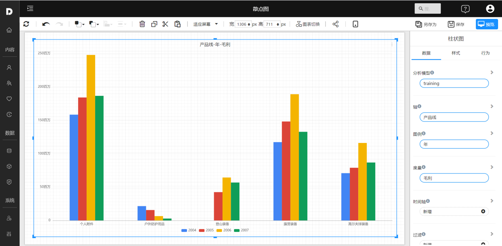
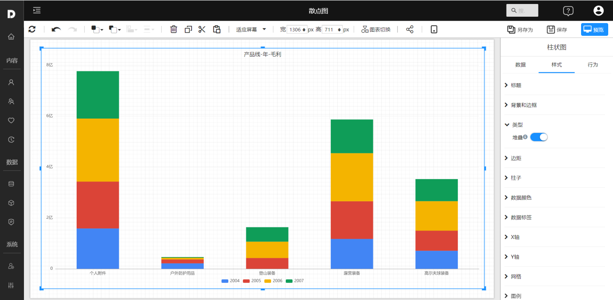

# 柱状图

柱状图是比较类图形的一种，使用垂直或水平的柱子显示类别之间的数值比较。其中一个轴表示需要对比的分类维度，另一个轴代表相应的数值。

## 适用场景

- 分类数据的对比（设置轴字段）
- 分类数据交叉对比（设置轴和图例）
- 不同指标的对比（设置多个度量字段）

## 示例

### 基础柱状图

基础柱状图，使用柱子显示类别之间的数值比较。

### 簇柱状图

簇状条形图适合分析对比组内各项数据，也可以比较各个类别的值。

### 堆叠柱状图

堆叠柱状图将每个柱子进行分割以显示相同类型下各个数据的大小情况。它可以形象得展示一个大分类包含的每个小分类的数据，以及各个小分类的占比，显示的是单个项目与整体之间的关系。

## 其它设置