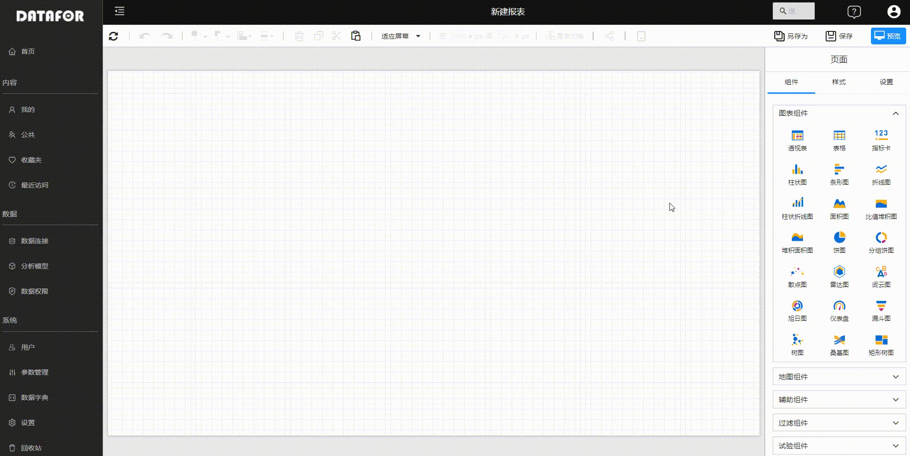
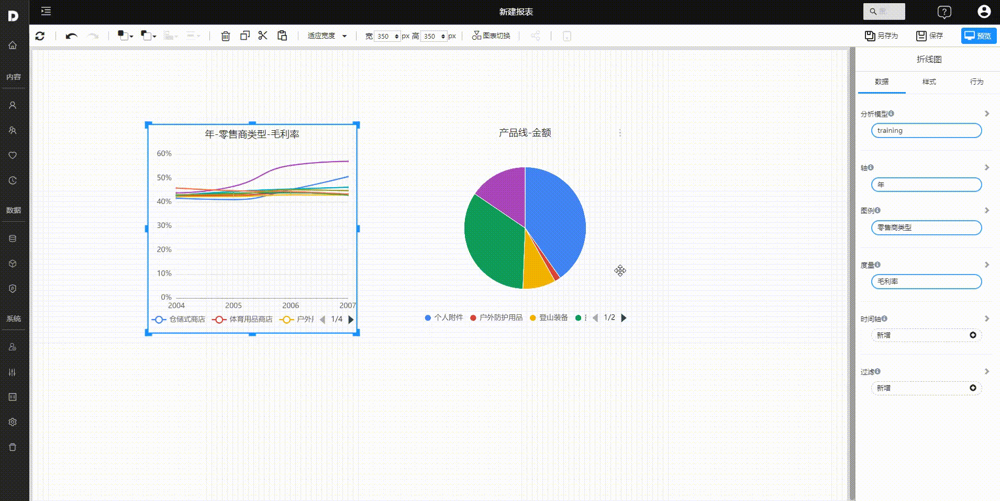
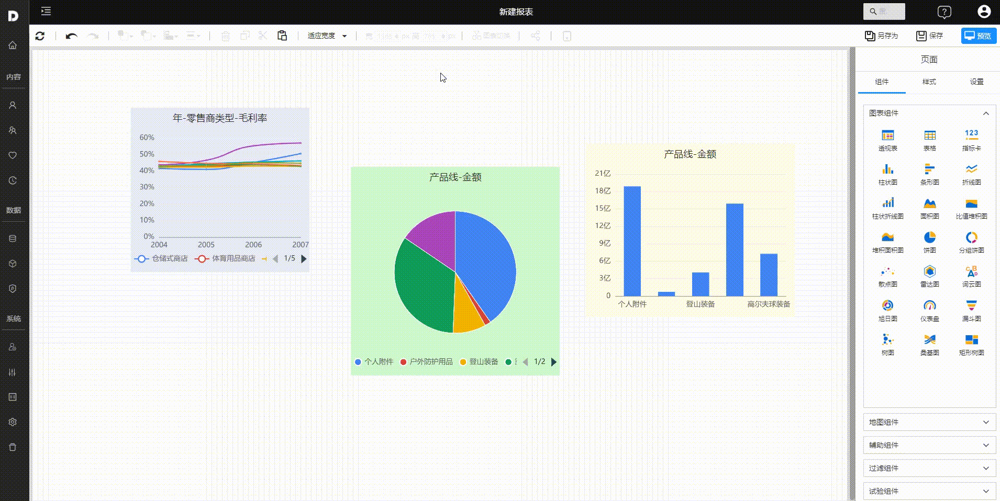
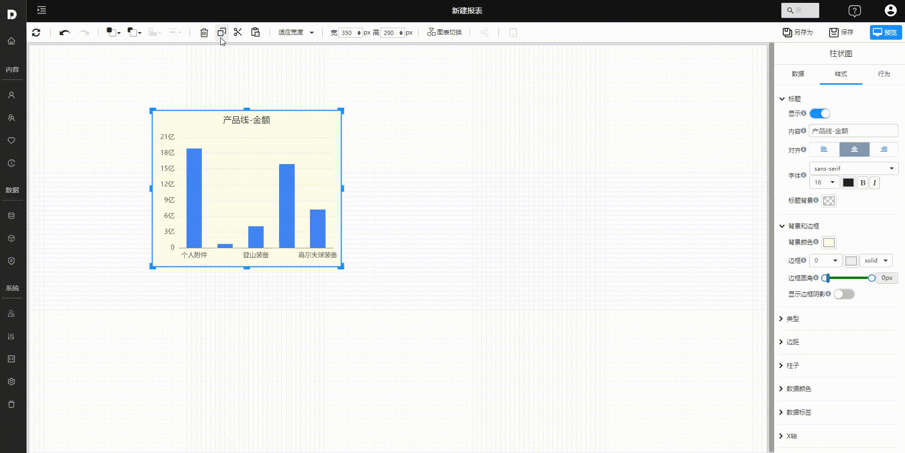
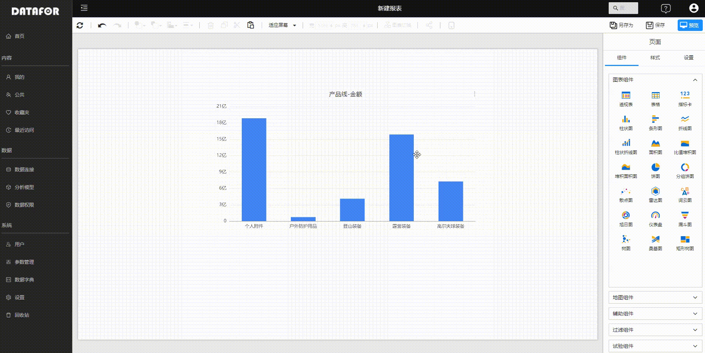

---
id: sjfxyksh-zjdbjsj
title: 组件的布局和设计
sidebar_position: 2
---

# 组件的布局和设计

DATAFOR的页面布局是”自由布局“，用户可以在页面上灵活的添加、摆放组件，设置组件的层次，制作个性化的分析报表。

## 组件的添加和删除

**添加组件**：页面设计器右侧的组件面板，点击选中组件，在画布区域点击鼠标并拖动鼠标，一个没有绑定数据的组件就添加到了画布上。

**删除单个组件**：在画布上点击选中组件，按”Delete“键，或者在工具栏点击”删除“按钮。

**删除多个组件**：Ctrl键+鼠标点击组件或者鼠标在画布上通过拖画方式选中多个组件，按”Delete“键，或者在工具栏点击”删除“按钮。

## 组件的大小调整

两种方式：

- 当鼠标悬停在组件边界的粗线上时，鼠标状态变为双向箭头，此时您可以拖动鼠标来调整组件的大小。
- 在工具栏上的宽和高输入框中直接输入组件的宽度值和高度值。这同时调整多个组件的大小时，这种方法非常有效。

## 组件的移动

点击选中需要移动的组件，鼠标移到组件区域内，点击鼠标并保持按住状态，鼠标箭头变成移动图标，此时拖动鼠标，组件会随着鼠标图标移动位置。

## 组件的对齐和分布

1. 选中多个组件。

   - 鼠标拖拽区域将多个组件选中
   - 使用Ctrl键选中多个组件
   - 使用Ctrl+A选中页面上全部的组件

 2. 点击工具栏上的对齐下拉按钮或分布下来按钮

       - 对齐：左侧对齐、右侧对齐、顶部对齐、底部对齐、水平中心对齐、垂直中心对齐
       - 分布：垂直均匀分布、水平均匀分布

## 组件的层次调整

自由布局下，所有的组件都具有层次关系。每一次添加一个组件后，该组件会默认置于最顶层。

选中一个或多个组件，在工具栏上选中层次调整下拉按钮，并选中合适的层次调整方法：上移一层，置顶，下移一层，置底。

## 组件的复制

支持复制/剪切、粘贴单个组件或多个组件，支持跨页面复制/剪切和粘贴。

- 选中一个或多个组件，通过工具栏上的复制、剪切、粘贴按钮进行复制、剪切、粘贴操作。
- 选中一个或多个组，通过快捷键Ctrl+C、Ctrl+X、Ctrl+V进行复制、剪切、粘贴操作

## 组件类型的切换

在设计过程中，组件类型可以切换，切换后的组件使用原来组件的数据模型。

