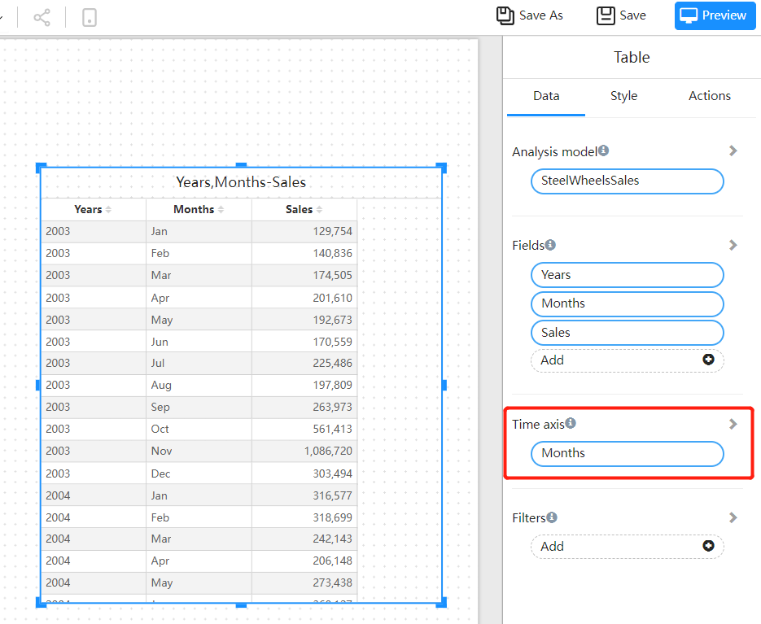
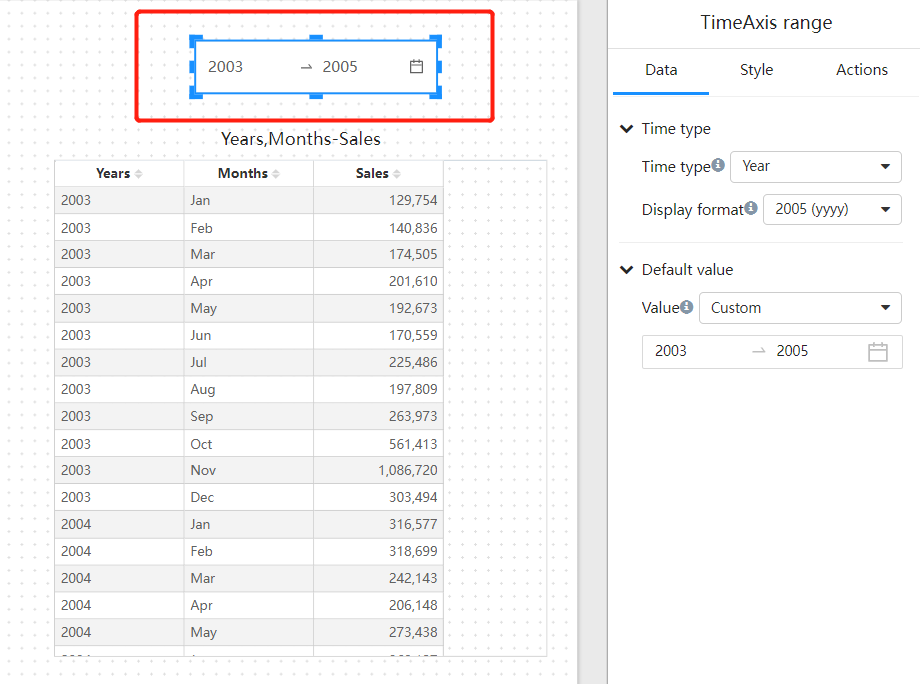

# Time axis

## What is the "Time axis" for?

The usefulness of the time axis is to filter multiple "time fields" on the model through the "Time axis filter" component.

For example, the model contains "sale date", "purchase date", and "purchase date", or there are indicators with different time granularities, such as "Sales budget amount" with a granularity of "year", and "sales amount" with a granularity of "day".

So how to filter the different components of these models on the page through one time filtering component, then you need to use the "Time axis".

1. How to use "Time axis"?

   1. Chart component setting "Time axis" field

      

2. Add a "Time axis" filter component to the report page

   

3. Create a subscription relationship between the ”Time axis filter" component and the chart component

