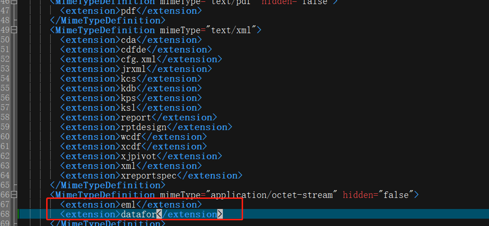

# Visualizer Setup Manual

1. Unzip **Visualizer.zip** to the **pentaho-solutions\system** directory

   <div align="left"></div>

   

2. Modify the **ImportHandlerMimeTypeDefinitions.xml** file in the **pentaho-solutions\system** directory and add the following content.

   ```
   <MimeTypeDefinition mimeType="application/octet-stream" hidden="false">
           <extension>eml</extension>
           <extension>datafor</extension>
   </MimeTypeDefinition>
   ```

   <div align="left"></div>

3. Modify the **applicationContext-spring-security.xml** file in the **pentaho-solutions\system** directory and add the following content.

   ```
   <sec:intercept-url pattern="\A/content/datafor/.*\Z" access="Anonymous,Authenticated" />
   ```
   <div align="left"></div>

   ```
    <sec:intercept-url pattern="\A/plugin/datafor/api/.*\Z" access="Anonymous,Authenticated" />
   ```
   <div align="left"></div>

4. Modify the **server.properties** in the **pentaho-solutions\system** directory, change the server address to the corresponding URL for generating shared link addresses


   <div align="left"></div>

5. Installing Fonts (Required for Excel Export)

   If you are unable to export Excel files, it might be because OpenJDK is being used and the fonts are not installed. Please execute the following commands as the root user on the server to install the fonts.

   ```
   yum install fontconfig
   fc-cache --force
   ```

6. Restart PBA


   <div align="left"></div>

