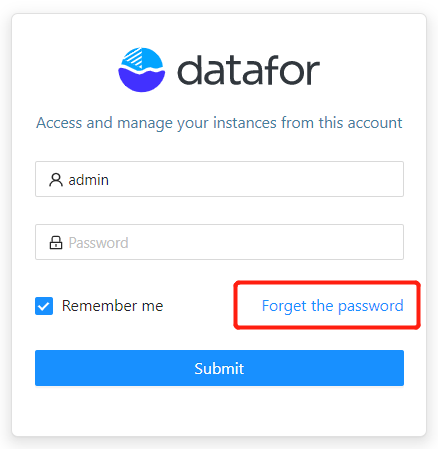
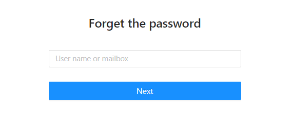

# Forgot password

After forgetting the password, the user can reset the password by himself.

Note: There are two prerequisites for using the reset password function:
   - The system configures the mailbox server information
   - The user's email address is set in the user information

1. Click "Forgot Password" on the login system page

   

2. Enter user email or login name

   

3. Check the email from Datafor to send the verification code

4. Enter the verification code and set a new password

5. After resetting the password, please log in to the system with the new password

