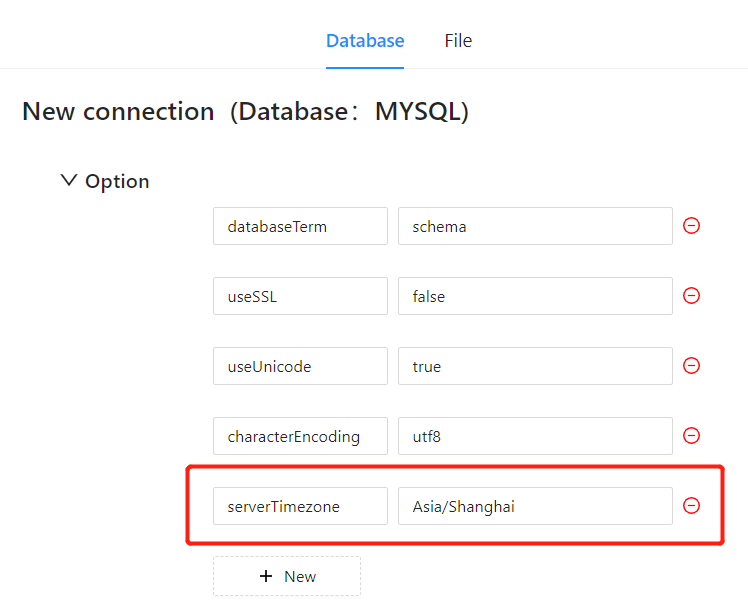

# JDBC Timezone Setting

JDBC requires timezone parameter setting because different databases store and calculate time based on specific timezones. If JDBC connection does not have timezone setting, it will default to use the local computer's timezone, which may not be consistent with the database timezone and cause timestamp conversion errors. For example, if the database timezone is set to UTC and JDBC connection uses local timezone, timestamp deviation may occur. Therefore, when performing database operations, we need to set the timezone parameter of the JDBC connection to ensure correct timestamp conversion and avoid timestamp deviation.

## How to set timezone parameter

Add the timezone parameter and value in the "options" of the database connection configuration.

