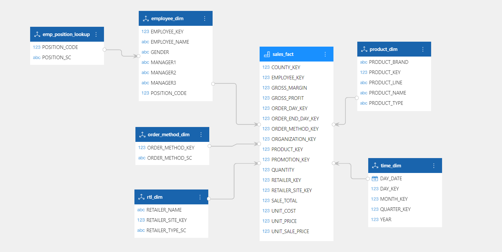

---
id: fxmx-fxmxgs
title: Overview of Analysis Models
sidebar_position: 1
---
# Overview of Analysis Models

The DATAFOR analysis model uses a multidimensional model, which is a data structure used to support multidimensional analysis. It can slice data from different dimensions to achieve multi-angle analysis. The multidimensional model can meet the analysis needs of different business areas and levels, allowing users to gain new business perspectives and decision-making bases through data analysis. In enterprise management and decision-making, multidimensional models can be used in market analysis, sales analysis, customer analysis, financial analysis, and other areas.

## Dimension Tables and Fact Tables

In a multidimensional model, dimension tables and fact tables are the two basic types of tables. Dimension tables are used to describe the attribute information of different dimensions, such as time dimensions, geographic dimensions, product dimensions, etc. They are used to filter and slice data to achieve multidimensional analysis. Fact tables are used to describe specific measure information, such as sales, visits, etc. They are associated with dimension tables through shared keys to achieve multidimensional analysis of data.

## Star Schema and Snowflake Schema

In multidimensional models, star schema and snowflake schema are the two most commonly used models. DATAFOR supports the creation of both star and snowflake schemas.

### Star Schema

Star Schema is a common multidimensional data model consisting of a central Fact Table and multiple Dimension Tables. The central Fact Table contains various measure data, while Dimension Tables contain various attribute information describing these measure data.

In the Star Schema, Dimension Tables and Fact Tables are directly connected, forming a structure similar to a star, hence the name "Star Schema". Dimension Tables usually contain multiple columns, which describe the attribute information of the measure data, such as the year, month, and day in the Time Dimension Table; product name, color, brand, and other product attributes in the Product Dimension Table; customer name, address, contact information, and other customer attributes in the Customer Dimension Table.

The central Fact Table typically contains one or more measure data columns. Measures refer to actual data that needs to be measured, such as sales revenue, sales volume, etc. Each row of data in the Fact Table represents a measure event, which is connected to one or more rows of data in the Dimension Tables, forming a Star Schema.

### Snowflake Schema

Snowflake Schema is based on the Star Schema and further decomposes some of the dimension tables into multiple tables, forming a structure similar to a snowflake, hence the name Snowflake Schema. The advantage of the Snowflake Schema is that it can flexibly express complex multidimensional analysis requirements, but the disadvantage is that the query performance is relatively lower.

## How to design a multidimensional model

When designing a multidimensional model, the following points should be taken into consideration:

1. Determine business requirements

   Before designing a multidimensional model, it is important to understand business requirements and analysis objectives, clarify analysis goals and priorities, as well as the indicators and data sources that need to be analyzed. This step is crucial because the design of a multidimensional model needs to be based on business requirements and analysis objectives to ensure its effectiveness and accuracy.

2. Determine dimension tables

   Identify the dimensions that need to be analyzed based on business requirements and analysis objectives. Dimensions are attributes that describe facts, such as time, location, product, and customer. Dimensions have hierarchical structures, such as time dimensions can be divided into years, quarters, months, days, etc., and product dimensions can be divided into categories, brands, models, etc.

3. Determine fact tables

   When determining fact tables, it is necessary to consider the events or transactions that occur in the business process and the indicators that need to be analyzed. Facts are usually numeric data such as sales, volume, profit, etc., but can also be other types of data such as customer satisfaction. When determining facts, it is necessary to consider granularity, that is, what actual events each fact corresponds to and what kind of measurement needs to be applied to these events.

4. Design star schema or snowflake schema

   Based on the relationship between dimension tables and fact tables, design a star schema or snowflake schema. In the star schema, each dimension table is directly associated with the fact table, forming a star-shaped structure. In the snowflake schema, each dimension table may be associated with other dimension tables, forming a structure similar to a snowflake.

5. Design dimension hierarchy

   For each dimension table, design its hierarchy structure so that users can analyze and query data at different levels. The hierarchy structure usually consists of multiple dimension levels, such as time dimensions can be analyzed by year, quarter, month, etc.

6. Optimize the model

   After designing the model, it needs to be optimized. Optimizing the model can improve query performance, including techniques such as adding aggregate fact tables, merging dimensions, and using partitioning. At the same time, the model needs to be tested and tuned.