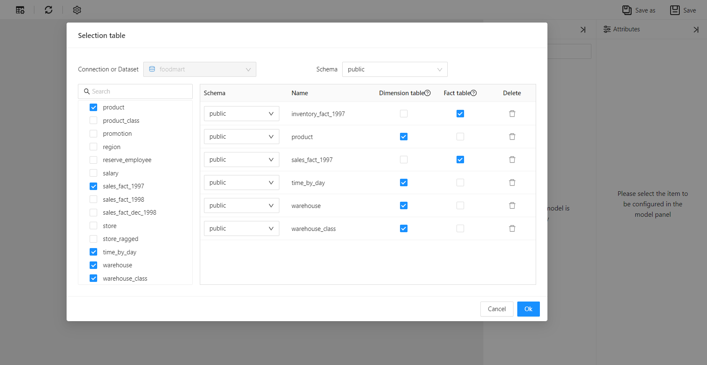
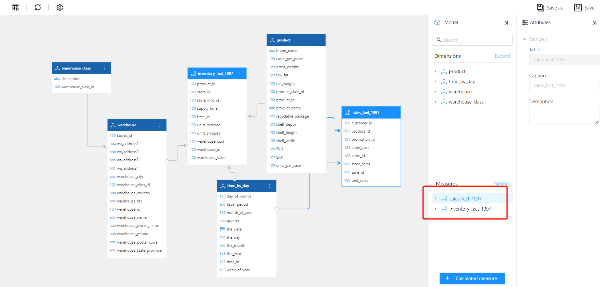

id: sjfx-dssb
title: Multiple Fact Tables
sidebar_position: 30

# Multiple Fact Tables

Multiple fact tables refer to the use of multiple fact tables in an analytical model to support analysis requirements. These fact tables may relate to different subjects or business processes, but they all belong to the same data warehouse. For example, a company may have a sales fact table to track metrics such as sales revenue and sales volume, and also have an inventory fact table to track metrics such as inventory levels and purchase volume.

## How to Create a Multiple Fact Table Model

Set up multiple tables or views as "fact tables".

Datafor automatically creates a multiple fact table model based on the settings.

