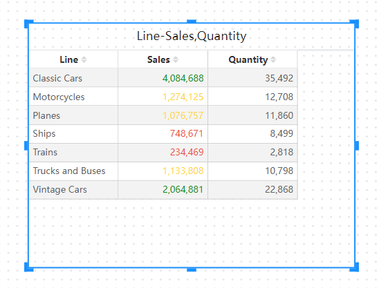

# Conditional color

With conditional colors, you can define cell background colors, cell indicator colors, and chart data colors based on indicator values.

## Set the background or font color

To set a background or font color, select "Cell font color" or "Cell background color" in the Measure menu.

The Background Color or Font Color dialog box opens with the name of the field being formatted in the title. Select Enable.

## Set color by color scale mode

If you want to set the cell background or font color by color scale mode, please select "Grade Mode" in the "Condition Type" of "Background Color" or "Font Color". Under By Field, select the field you want to base the formatting on. Formatting can be based on other measure fields in the model.

Select measure and Min Color and Max Color.

## Set color by rule model

To set the cell background or font color by color rule mode, please select "Rule mode" in the "Colors by" of "Background color" or "Font color". Select the measure you want to base the formatting on. Formatting can be based on other measure fields in the model.

In the Rule List, create one or more value ranges and set the color for each value range. The cell background or the font in each value range is colored with the given color.

