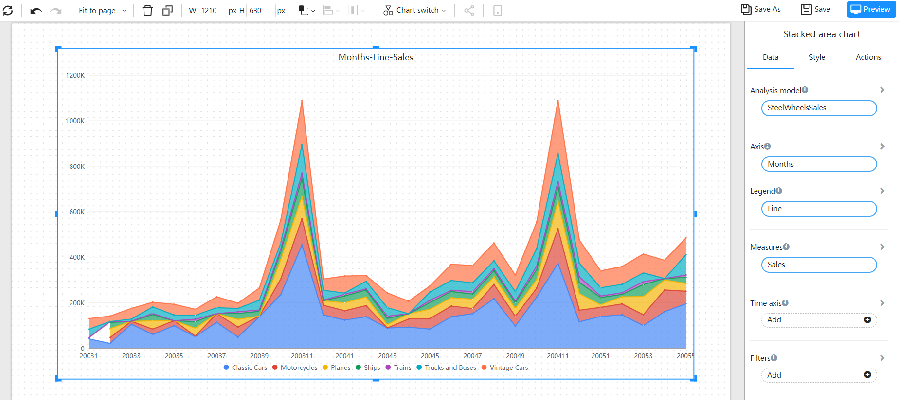

# Stacked area

The stacked area chart is the same as the basic area chart. The only difference is that the starting point of each data set on the chart is different. The starting point is based on the previous data set, which is used to display the trend line of the size of each value changing with time or category. Shows the relationship of parts to the whole.

## Applicable scene

- Series comparison and percentage
- Time trend proportion

## composition

1. The x-axis is usually time, or a continuously changing quantity
2. The Y-axis can be quantity, or composition as a percentage of the data.
3. The different series are represented in the form of an area chart, stacked together.
## Example

## Settings

| Items | Reference Documents |
| -------------- | -------- |
| Background and border | |
| Legend | |
| | |