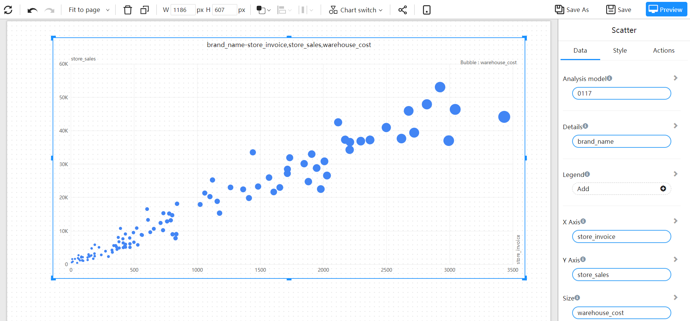

# Scatter

A scatter chart has two value axes: one set of numeric data along the horizontal axis and another set of numeric data along the vertical axis. The chart displays data points at the intersection of the x and y values. Through the size, color and position of the dots, the mutual influence relationship between the values is reflected.

## Applicable scene

- Shows the relationship between two metrics.
- The two metrics need to be plotted as a series of x and y coordinates.
- Displays linear or non-linear trends, clusters and outliers.

## Composition

1. In scatter and bubble charts, the x-axis and y-axis values **must be measures**.
2. X-axis values are usually explanatory variables (**Reason**).
3. The Y-axis value is usually the response variable (**Result**).
4. The bubble chart is an extension of the scatter plot. **The radius of the bubble** is the second response variable, which represents the relative magnitude of the data points.
5. If the data differ greatly, the size of the bubble area can be compared by relative size.

## Example

The dots on the graph represent products, the x-axis represents gross profit, the y-axis represents sales amount, and the size of the dot represents the gross profit margin.

Through the points on the graph, you can see the distribution of products on each indicator axis, and you can find some "outliers".

The distribution of indicators of products in different retailer dimensions is distinguished by color.

