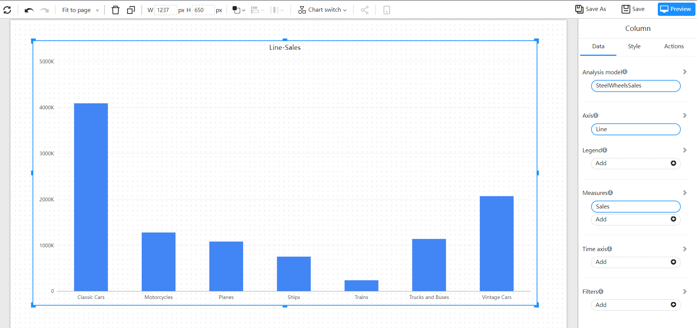
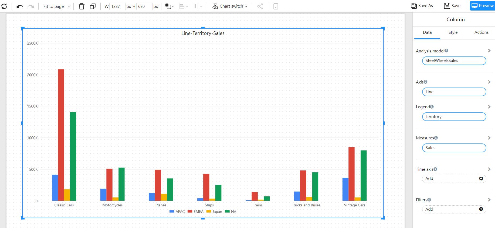

# Column

A Column chart is a type of comparative graph that uses vertical  columns to show numerical comparisons between categories. One of the axes represents the category dimension to be compared, and the other axis represents the corresponding value.

## Applicable scene

- Comparison of categorical data (set axis fields)
- Cross-comparison of categorical data (setting axes and legends)
- Comparison of different indicators (set multiple measurement fields)

## Example

### Basic Column chart

A basic histogram, using columns to show numerical comparisons between categories.

### Cluster column chart

Cluster bar chart are suitable for analyzing and comparing various data in groups, and can also compare the values of various categories.

### Stacked column chart

A stacked bar chart divides each column to show the size of each data of the same type. It can vividly display the data of each sub-category contained in a large category, as well as the proportion of each sub-category, showing the relationship between a single item and the whole.

## Settings