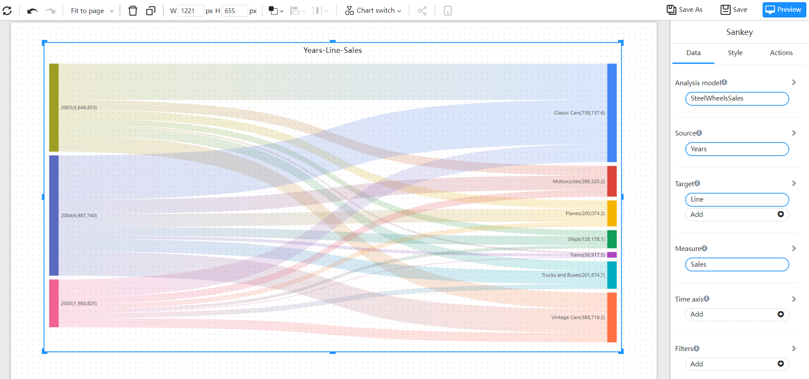
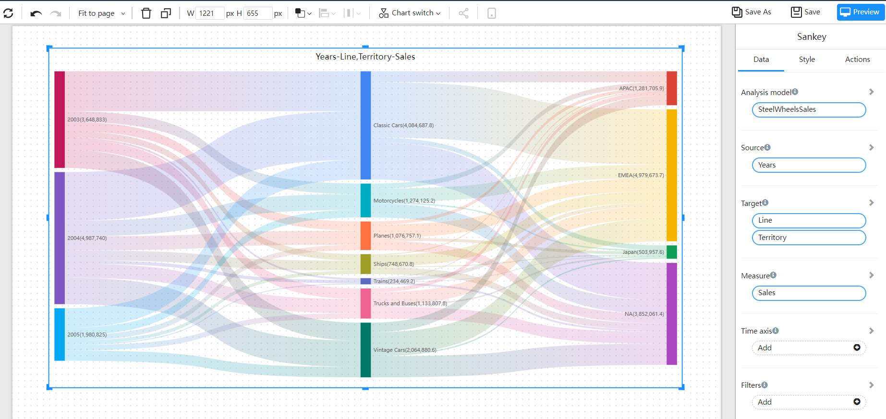

# Sankey

Sankey chart, also known as Sankey energy balance diagram, is mostly used to represent the flow direction of data and the size of data flow.

## Applicable scene

- Data flow
- Data size in different flow directions

## Composition

1. Two or three dimensions
2. A measure

## Example

Data flow direction and size between two dimensions.

Data flow direction and size among three dimensions.

