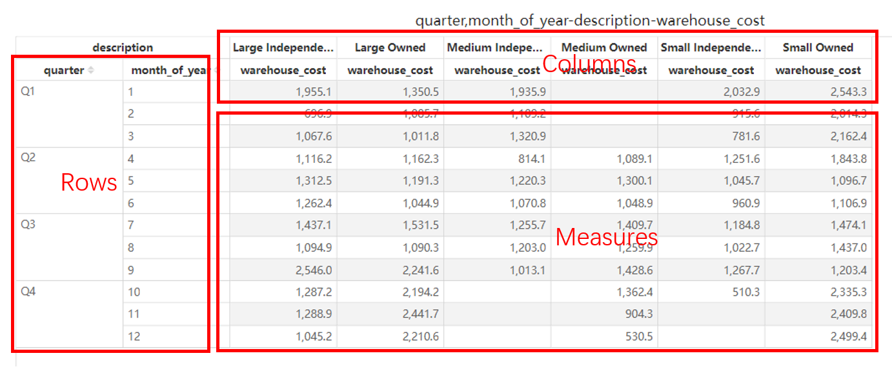
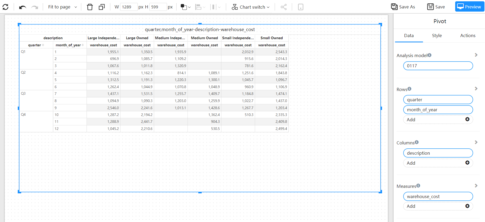
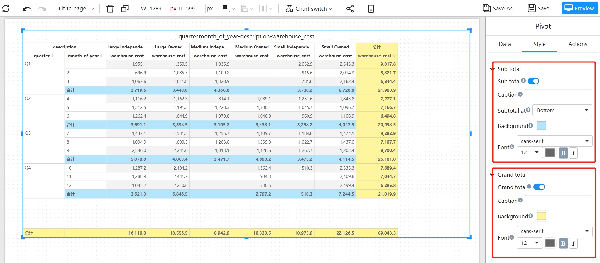

# Pivot table

A Pivot Table is an interactive table that can perform certain calculations, such as sums and counts. The calculations and data are performed relative to the arrangement in the PivotTable. Pivot tables can dynamically change the row and column cross-dimensions to summarize and analyze data from different angles.

## Applicable scene

- Multi-dimensional, multi-indicator cross analysis
- Data analysis report

## Composition

1. A pivot table consists of **Rows**, **Columns**, and **Measures**.

2. **Rows**, there are one or more dimension fields.

3. **Columns**, there are one or more dimension fields.

4. **Measures**, which consists of one or more measure fields.

   

## Make a pivot table

1. **Set pivot table data**

   A pivot table consists of three data rows, columns, and measures.

   

2. **Sub total and Grand total**

   Both the row and column fields of the pivot table can be set to sub total summary and grand total summary.

   The "Sub total" and "Grand total" switches in the style panel can turn on or off the total and total row, and can adjust the background color, font size and other style properties.

   
