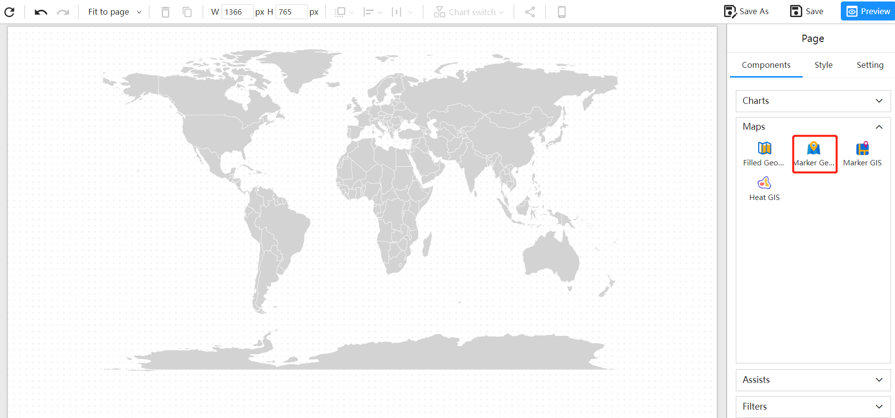
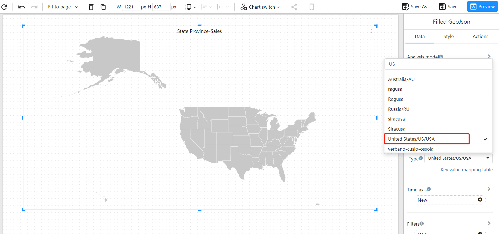
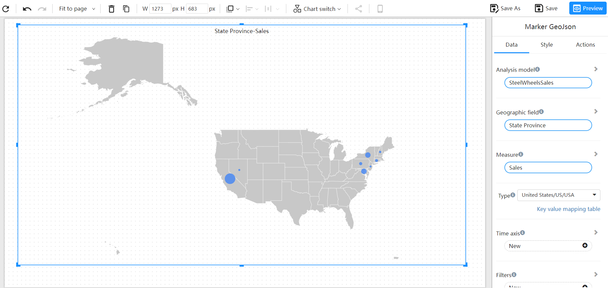
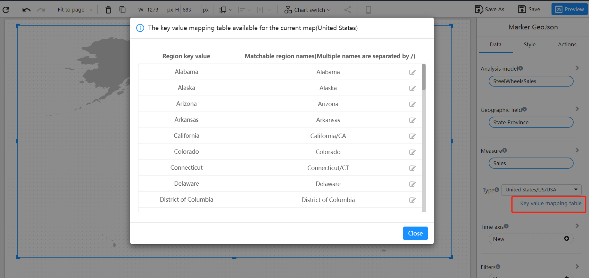

# GeoJSON marked map

A GeoJSON marked map is a map that encodes geographical location information as data in the GeoJSON format and marks it on the map. The GeoJSON marked map can help users display geographical location information more intuitively on the map, such as marking different locations, paths, and regions.

## Creating a Map

1. Create a new report in Datafor and add a GeoJSON marked map component in the report's design mode. This will add a blank map to the canvas area of the report designer.

   

2. Select Map Data

   Select the required map JSON data from the data panel.

   

3. Add Geographic Data Fields

   

4. Customize Map Style
   You can customize the style of the map according to your preferences, including background color, border lines, labels, etc.

## FAQ

1. How do I match the names of my regions with the names of the regions in the GeoJSON file?

   You can maintain the mapping between the names of the regions in your map and the data in the "key-value mapping table".

   

2. Can I customize my own GeoJSON map?

   Yes, you can contact Datafor to customize a GeoJSON map for you.

   Contact email: marketing@datafor.com.cn

