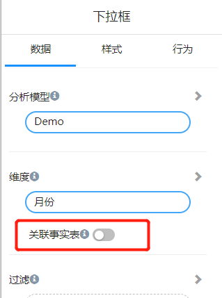
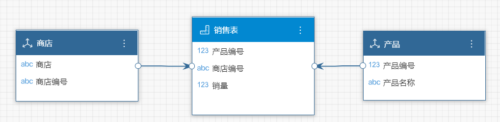
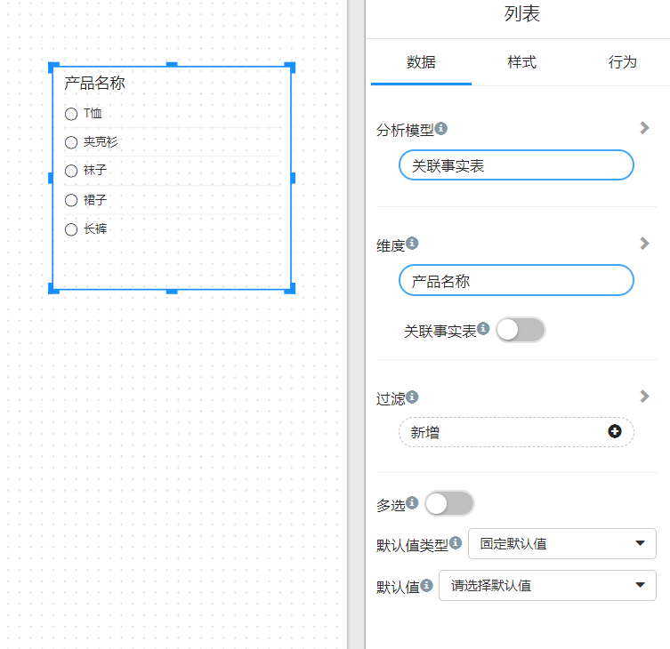
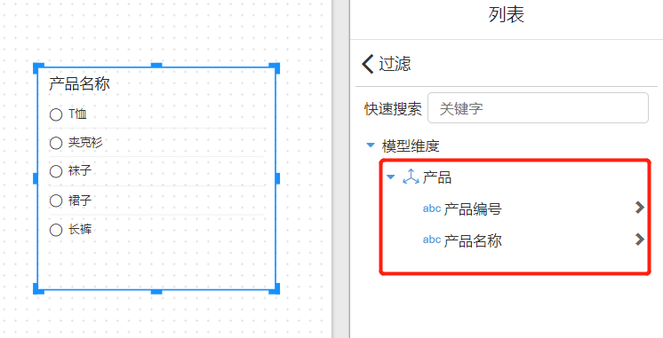
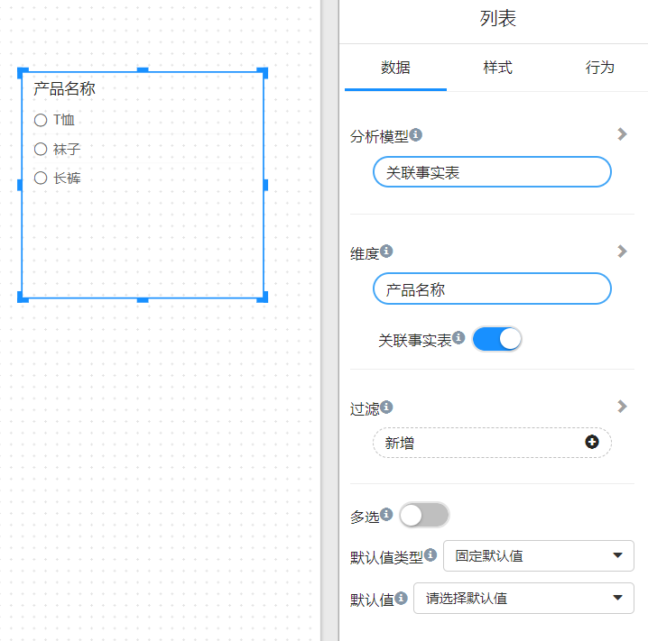
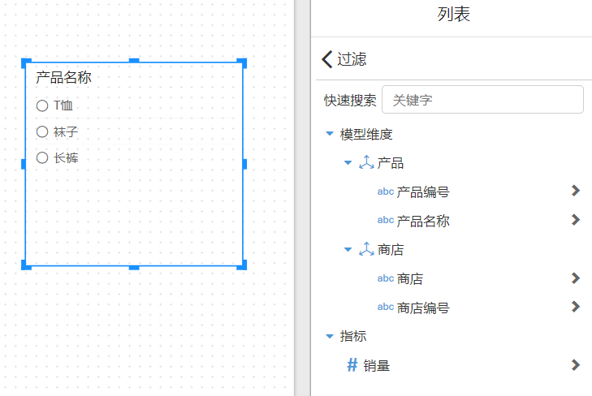

# "Join fact table" of filter components

Some filter components have a "Join fact table" switch on the "Data Panel". This article explains the function of this switch.

   

Let's use the scenario of 2 dimension tables and 1 fact table as an example.

## Analysis model

**维度表**

- 产品

  | 产品编号 | 产品名称 |
  | -------- | -------- |
  | 1        | 袜子     |
  | 2        | T恤      |
  | 3        | 长裤     |
  | 4        | 夹克衫   |
  | 5        | 裙子     |

- 商店

  | 商店编号 | 商店     |
  | -------- | -------- |
  | a        | 淮海路店 |
  | b        | 南京路店 |
  | c        | 外滩店   |

**事实表**

- 销售表

  | 产品编号 | 商店编号 | 销量 |
  | -------- | -------- | ---- |
  | 1        | a        | 100  |
  | 1        | b        | 120  |
  | 2        | a        | 50   |
  | 2        | c        | 200  |
  | 3        | c        | 200  |

  

## 不关联事实表

当列表框显示产品，不关联事实表的情况下，维度表里有几个产品就会显示几个。

过滤器里也只能看到产品维度的字段

## 关联事实表

打开”关联事实表“开关，只有在事实表中有的产品才会出现在列表框中。

过滤器中能看到事实表和其它维度表的字段。

