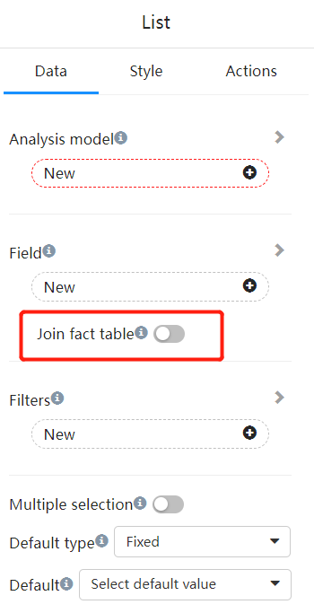
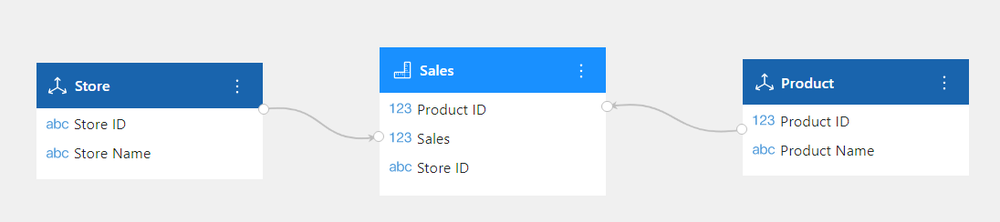
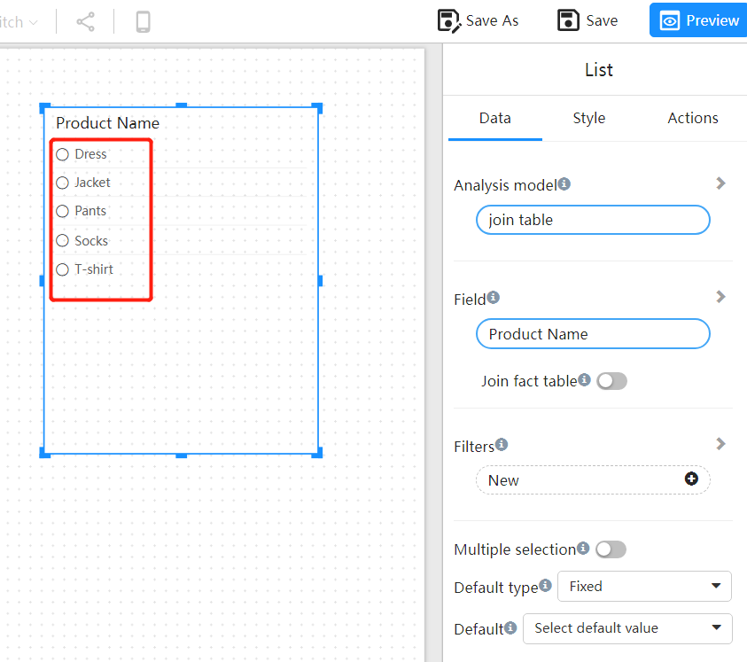
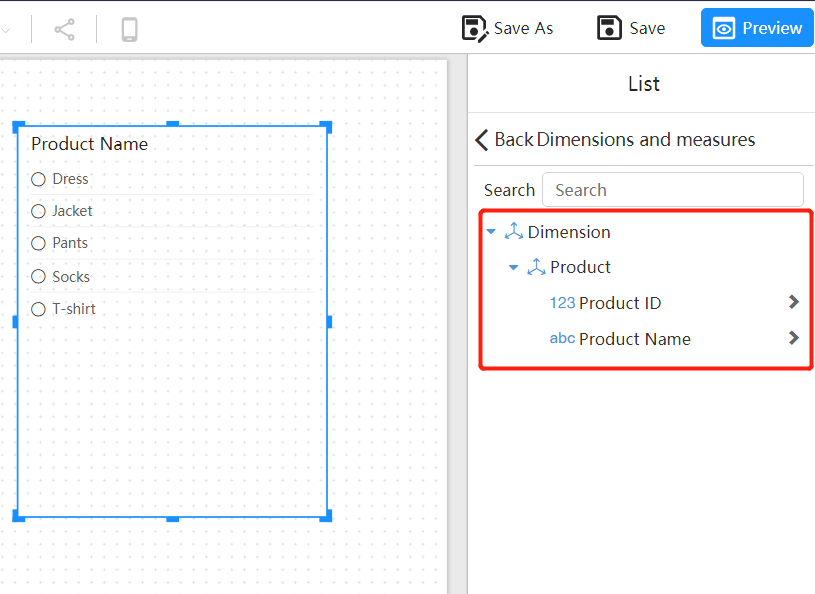
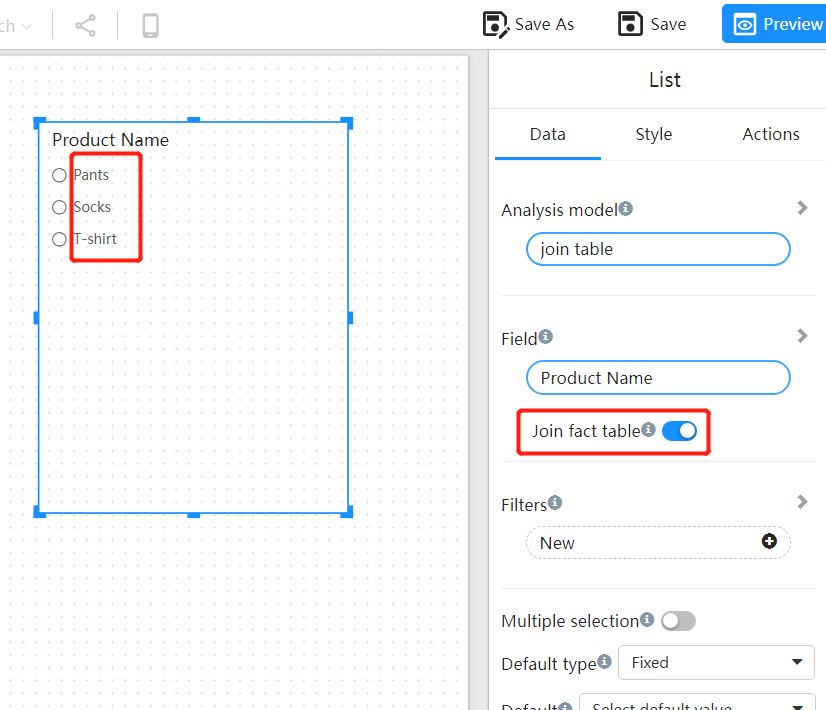
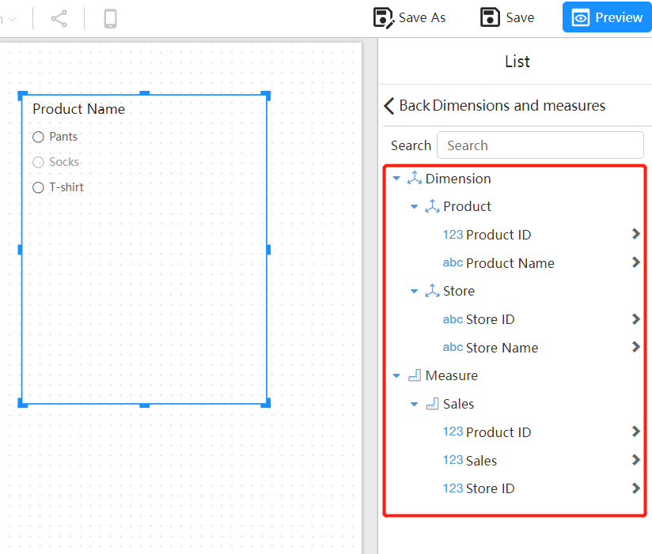

# "Join Fact Table" Switch on Filter Components

Some filter components have a "related fact table" switch on their data panel. This article explains the function of this switch.

## The Purpose of "Join Fact Table"

**Without Join Fact Table:** Query only the data in the dimension table, without any association with the fact table. Therefore, it is unable to obtain the measure values, and the returned result only contains pure dimensional data.

**With Join Fact Table:** Querying the dimension table associated with the fact table is done by connecting the dimension table and the fact table to retrieve data, and filtering can be done based on all the dimension attributes and measure values in the model.

Below, we use a scenario with two dimension tables and one fact table as an example to illustrate.

## Example

### Analysis model

**Dimension Tables**

- Product

  | Product ID | Product Name |
| ---------- | ------------ |
| 1          | Socks        |
| 2          | T-shirt      |
| 3          | Pants        |
| 4          | Jacket       |
| 5          | Dress        |

- Store

  | Store ID | Store Name     |
  | -------- | -------------- |
  | a        | Huaihai Store  |
  | b        | Nanjing Store  |
  | c        | The Bund Store |

**Fact Table**

- Sales fact

  | Product ID | Store ID | Sales |
  | ---------- | -------- | ----- |
  | 1          | a        | 100   |
  | 1          | b        | 120   |
  | 2          | a        | 50    |
  | 2          | c        | 200   |
  | 3          | c        | 200   |

### Without Join Fact Table

When the list box displays products, without an association with the fact table, the number of products displayed will be the same as the number of products in the dimension table.

The filter will only display the fields of the product dimension.

### With Join Fact Table

When the "Join Fact Table" switch is turned on, only the products that exist in the fact table will appear in the list box.

In the filter, you can see the fields of the fact table and other dimension fields.

