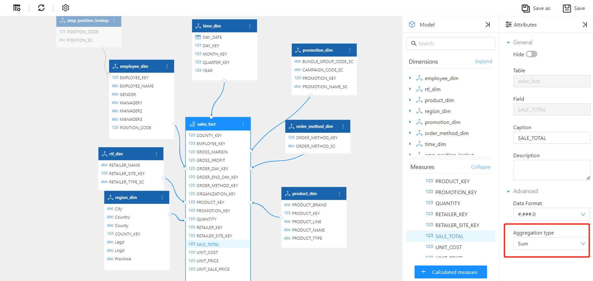
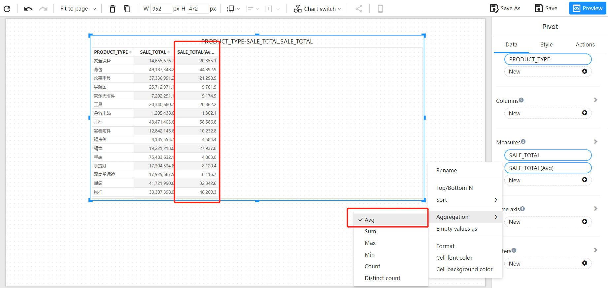

# Measure aggregation

measure aggregation refers to the process of summarizing and calculating one or more measures during data analysis to gain more meaningful insights. Common aggregation functions include average, sum, count, minimum, maximum, and so on.

## Setting Measure Aggregation
### Setting on Analytical Models

   The default aggregation method for measures in the analytical model is "sum."

   1. Select the measure in the analytical model that needs to be modified for aggregation.
   2. In the properties panel, find the "Aggregation Method" and modify the measure's aggregation method.
   3. After completing the settings, save the model.

### Setting when Setting Chart Data

Select the "Aggregation " menu in the function menu of the measure field and switch the aggregation method of the measure in the submenu.

