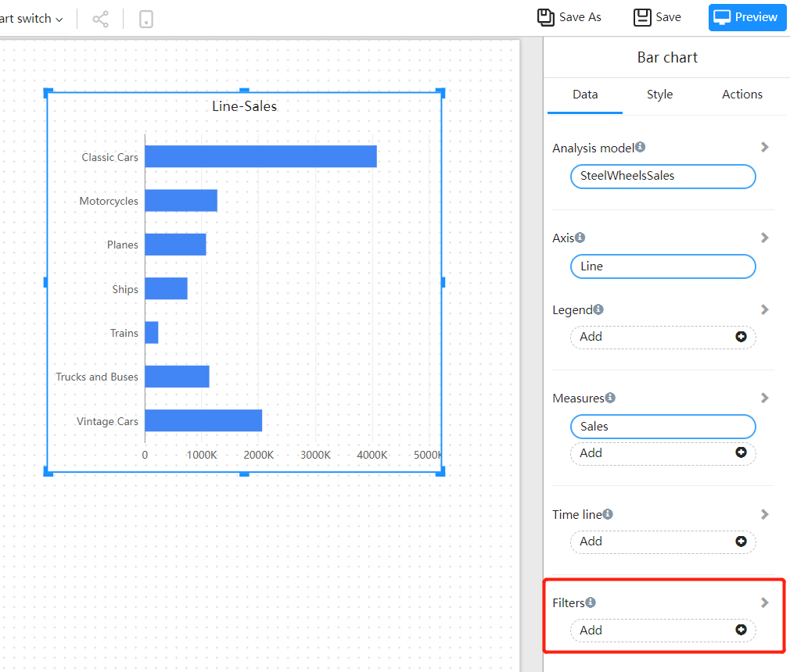
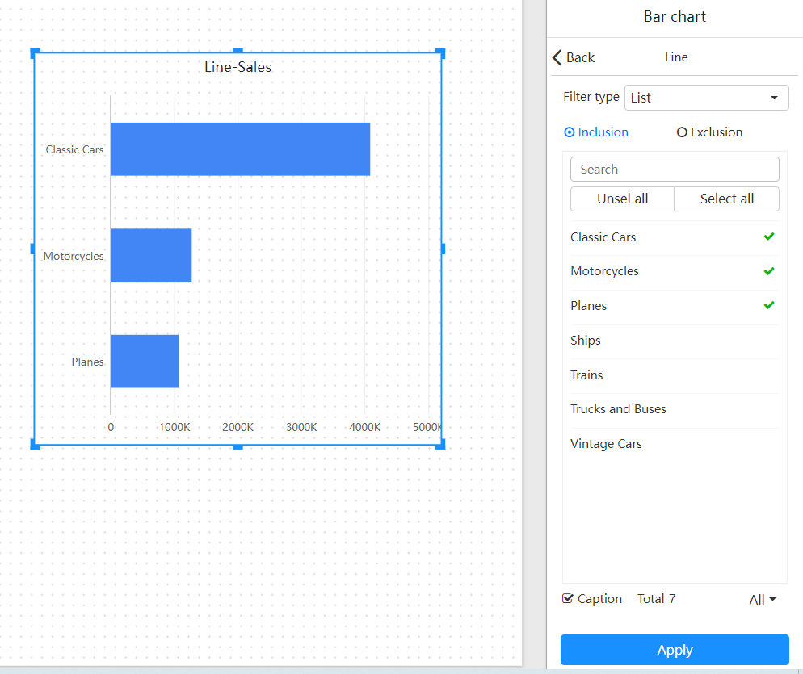
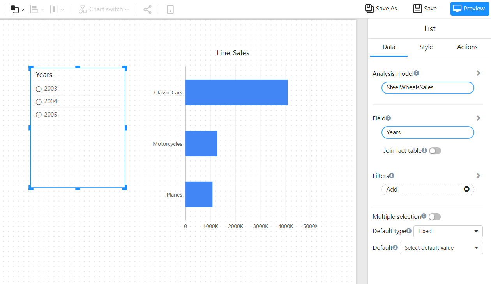
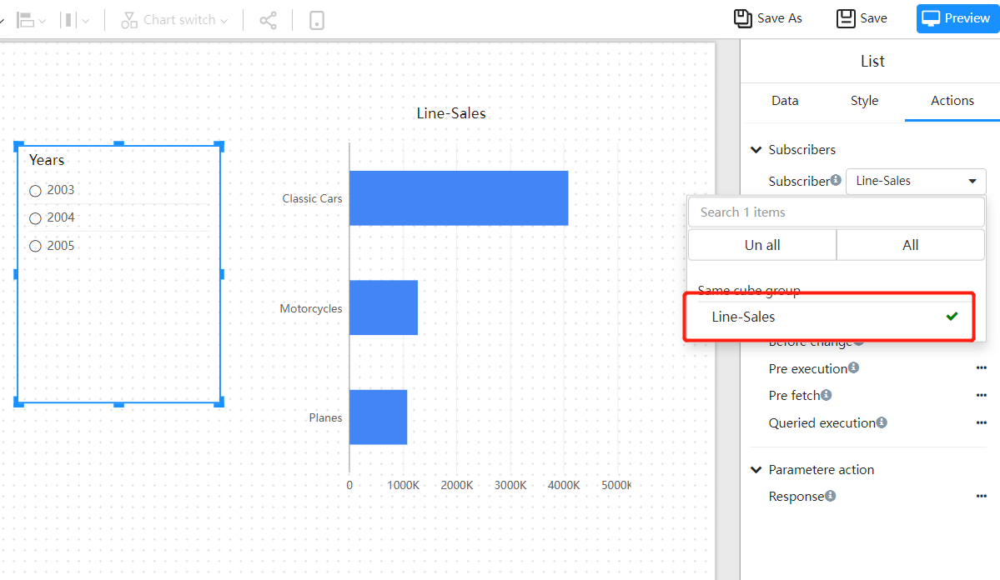
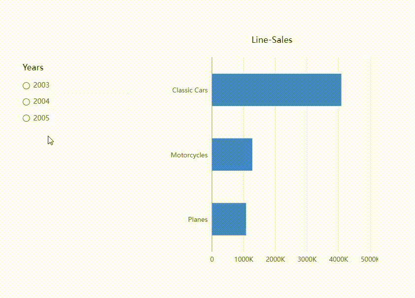
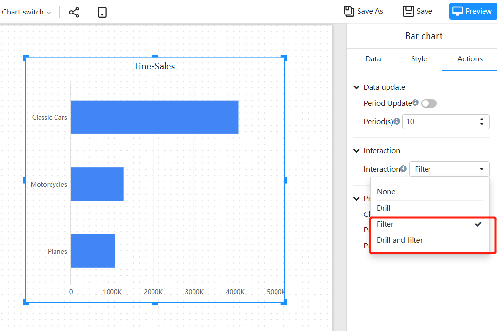

---
id: sjfx-sjdsxhgl
title: Data filtering
sidebar_position: 20
---
# Data filtering

## Overview

Datafor provides five data filtering methods:

- During the page design process, add component filter conditions in the data panel.
- By adding a filter component to the page, change the selected value of the filter component when viewing the page to filter the subscribed component data.
- By setting the "filtering" behavior of components, filtering and highlighting can be performed through the linkage between components when viewing the page.
- Use parameters in the SQL of the analysis model, and affect the parameter value through the filter component to achieve SQL layer data filtering.
- Filter reports by adding query string parameters to the URL

## Component add filter

Adding data filtering to components is added when analyzing report design:

1. Select the component on the page and add a "Filter" field in the data panel.

   

2. Set the value of the filter field

   

3. Filter methods for different types of fields

| Field Type | Filter Type | Filter Method |
| -------- | ------------ | ------------------------ ------------------------------------ |
| Text&emsp;&emsp;&emsp; | basic filter&emsp;&emsp;&emsp;&emsp; | include or exclude |
| | Advanced Filtering | Contains, Does Not Contain, Prefix, Suffix |
| Time | basic filtering | include or exclude |
| | Dynamic date filter | Select dynamic date, such as: today, last year |
| | Advanced Filtering | Before (<=), Equal to (=), After (>=) |
| Number | | less than, less than or equal to, equal to, greater than or equal to, greater than, greater than and less than, greater than or equal to and less than, greater than and less than or equal to, greater than or equal to and less than or equal to, not null data, null data |

## Filter components filter other components

The filter component is used to filter the data displayed by other components on the page.

1. Select an appropriate filter component, draw a filter on the canvas, and bind the dimension field to be filtered.

   

2. In the "Behavior" panel of the filter component, create a subscription relationship between other components on the page and this filter component. Components that have a subscription relationship will be affected by this filter component.

   

3. Preview the page, select the value in the filter component, and the subscribed component data will change accordingly.

   

## Filtering and highlighting

The "filtering" behavior of the component can highlight the data you are most concerned about, and pass the dimension value related to the highlighted data to other components on the page to filter the data of other components.

One of the two conditions must be met for the filter condition to have a filter effect on other components:
- Components use the same model
- the models used by the components have the same dimensions

1. Select "Filter" or "Drilldown and Filter" on the "Behavior Panel" of the component

   

2. Preview the page, click the position of the plot area of the chart component

    

## Pass parameters to SQL for filtering

## Add query string parameters to the URL to filter

Each page of the report has its own unique URL, add query string parameters to the URL to pre-filter the report. This scenario often occurs when the report page is embedded in other systems, and the report page is filtered after selecting filter conditions in other systems.

