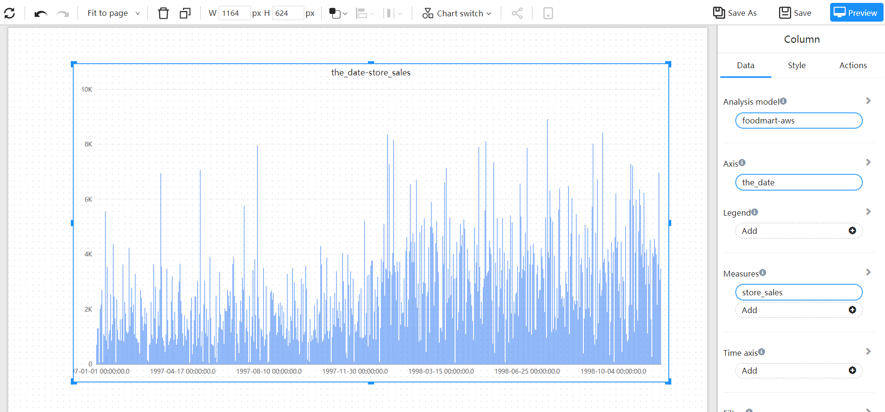
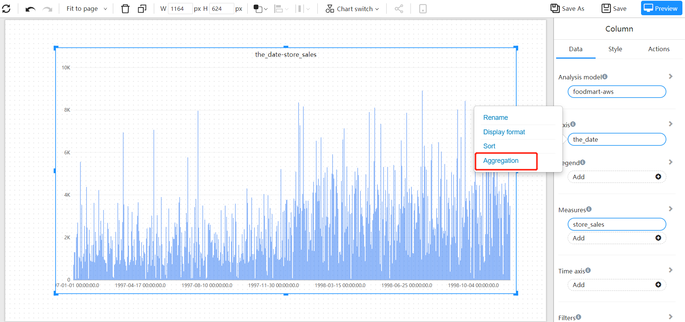
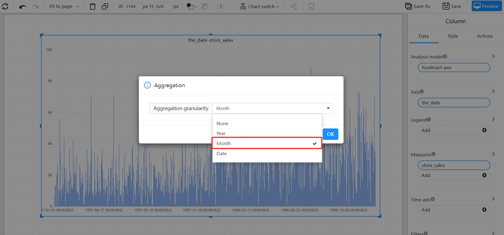
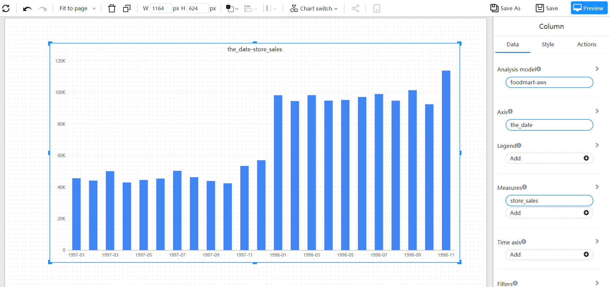

# Time summary

We have "day" granularity data, how to aggregate to "month", "quarter" or "year"?

## Two methods:

1. Create a "Time Dimension" table, and select time fields of different granularities in the time dimension to summarize.
2. Datafor provides time summary function

## Example:

We have a "day" granularity of data and made a histogram. But we want to see how the metrics compare at the month granularity.

 

Select field action menu

 

Select aggregation granularity

 

Get the granular data display we need

 

