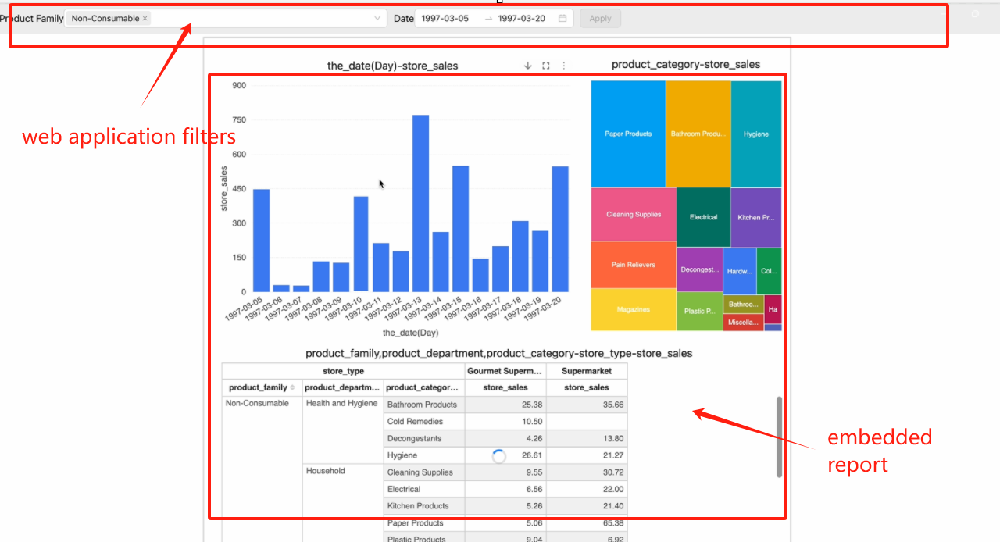

# Embedding Reports with XDM

> [!NOTE]
>
> In this document, "report" refers to visual reports created using the Datafor or Visualizer plugin.

Reports support XDM (Cross-Document Messaging) to filter report data without refreshing the report page. XDM can control data filtering, styles, and behavior of the reports. This guide focuses on data filtering.

## Scenario:

When embedding reports in a web application using an iframe, you may need to:

1. Filter the report data on the initial load.
2. Dynamically filter the report data without refreshing the report.

## Principle:

The web application communicates with the report via postMessage, sending filter parameters to the report. The report uses these parameters as filters, distributing them to each chart component, which then re-queries to achieve data filtering.

## Usage:

1. **Add Query Parameter to the Report URL:**

   When opening the report in the main program, add the query parameter `__xdmTimeout=150` to the report URL, for example: `http://hostname:port/datafor/index.html?__xdmTimeout=150`.

   Explanation: After opening the report, it will broadcast an initialization message and wait for 150ms. If a valid response is received within this time, the response information will be used as the initial data filtering condition. Adjust the delay time based on the main program's response speed. If filtering is not needed on the initial load, this parameter can be omitted.

2. **Include XMDWorker Class in the Main Program:**

   Add the following class XMDWorker in the main program to forward XDM messages. The main program can use the send method of this class to pass filter parameters to the report.

   ```js
   class XMDWorker {
       constructor({ onPageInitEvent = () => { } }) {
           this.reportId = null;
           window.addEventListener('message', (msg) => {
               const { data } = msg;
               let reportMessage;
               try { reportMessage = JSON.parse(data); } catch (d) { }
               if (reportMessage) {
                   if (reportMessage.event == 'visualizerReportFileLoaded') {
                       this.reportId = reportMessage.id;
                       onPageInitEvent();
                   }
               }
           });
       }
   
       send(data, target, init = false) {
           if (!this.reportId) {
               console.error('No reportId found, please wait for the report to be loaded');
               return;
           }
           const message = {
               trustMark: this.reportId,
               event: 'query',
               init,
               filters: data,
           };
           target?.postMessage(JSON.stringify(message), '*');
       }
   }
   ```

3. **Initialize XDMWorker Before Creating the Iframe:**

   Before creating the iframe to open the report, initialize an XDMWorker object. If filtering is needed on the initial load, call the send method within the `onPageInitEvent` event and set the third parameter to true.

   ```js 
   const xdm = new XMDWorker({
       onPageInitEvent: () => {
           iframeRef?.current && xdm.send(
               [
                   //message
               ], 
               iframeRef.current?.contentWindow, 
               true
           );
       }
   });
   ```

4. **Dynamically Control Report Filters:**

   After opening the report, call the send method from the main program to dynamically control report filters. The report will respond immediately and re-query data.

5. **Send Method Format:**

   ```js   
   send(message, target, init)
   ```

   Parameter Description:
   - `message`: Array of filter parameters in the following format:
     ```js
     [{
         value: [
             [
                 {i: 0|1, v: string|number},  // Range filter: includes i (0 or 1) and v (boundary value, number or string)
                 {i: 0|1, v: string|number}
             ], 
             string|number,  // Original value
             ...
         ],  
         name: string,  // The uniqueName property value of the target level in the multi-dimensional analysis model
         type: string,  // Filter action type: "name" or "caption"
         datatype: string|number|timestamp  // Data type of the filter value
     }]
     ```
   - `target`: Window object of the iframe containing the Visualizer report
   - `init`: Boolean indicating if the filter parameters are for initial report load

6. **Complete Example:**

   Refer to the sample project: [Passing Messages to Reports Using XDM](https://github.com/datafor123/visualizer-xmd-demo/tree/main).

   <div align="left"></div>
7. **Opening Reports in New Windows or Tabs:**

   XDM can also be used to filter report data in reports opened in new windows or browser tabs.