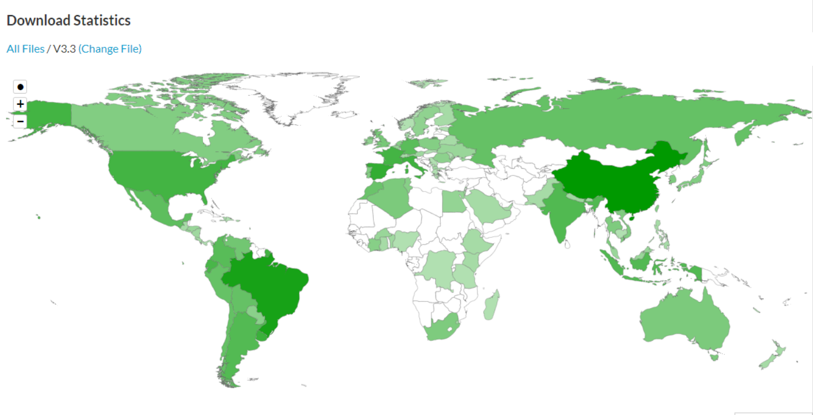

---
sidebar_position: 1
description: This is a help document。
keywords:
  [
    datafor,
    document
  ]
slug: /
id: intro
title: Welcome
---

# Datafor data visualization and analysis

Datafor data visualization and analysis can help you easily conduct exploratory data analysis, making boring data intuitive, vivid, and easy to understand, helping you understand business, discover problems, find reasons, and provide basis for further decision-making.

> 🚀**This document is continuously updated...**

