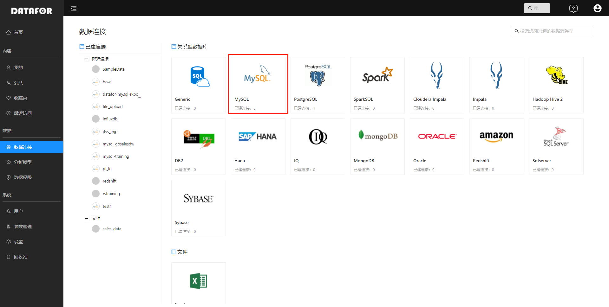
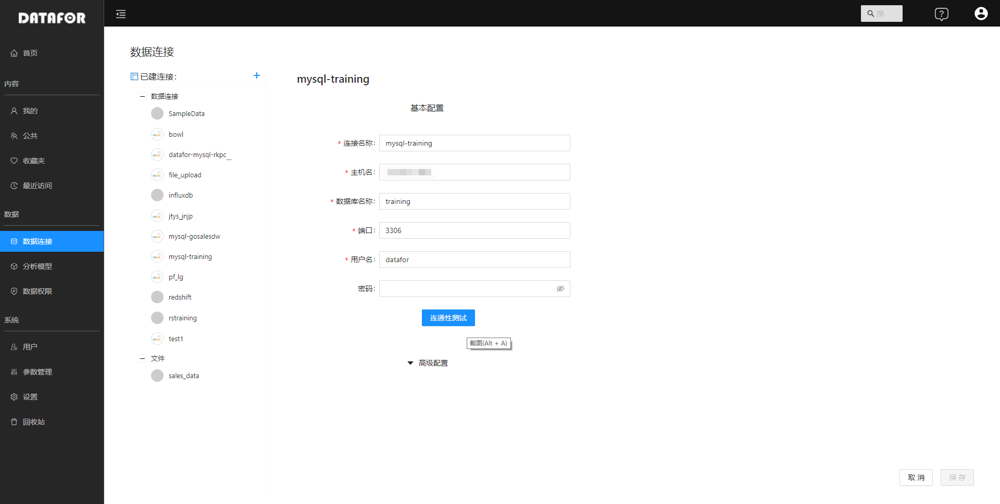
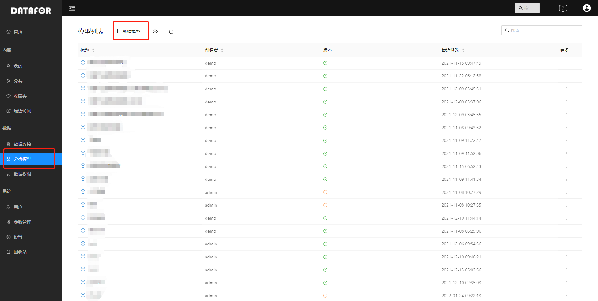
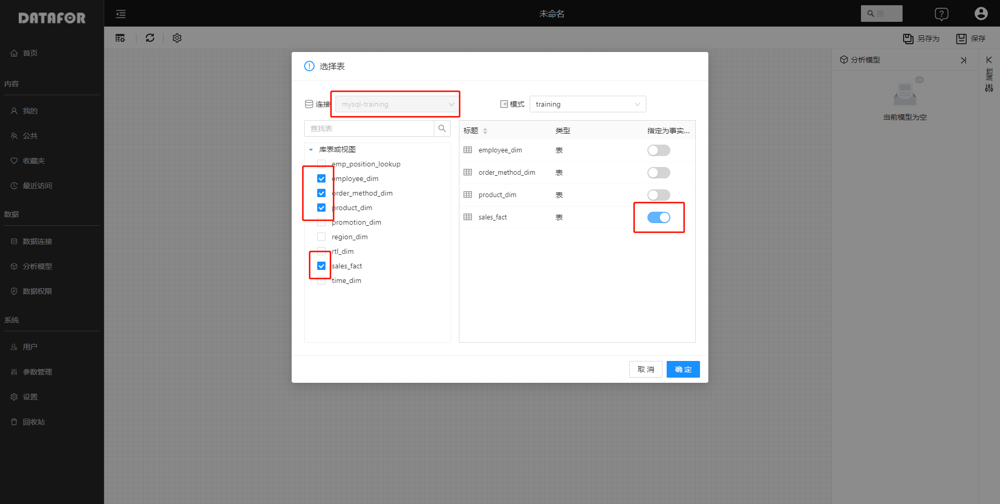
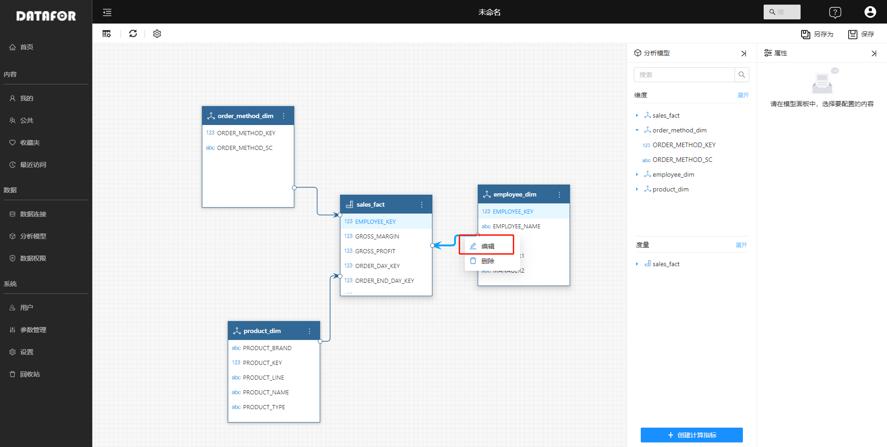
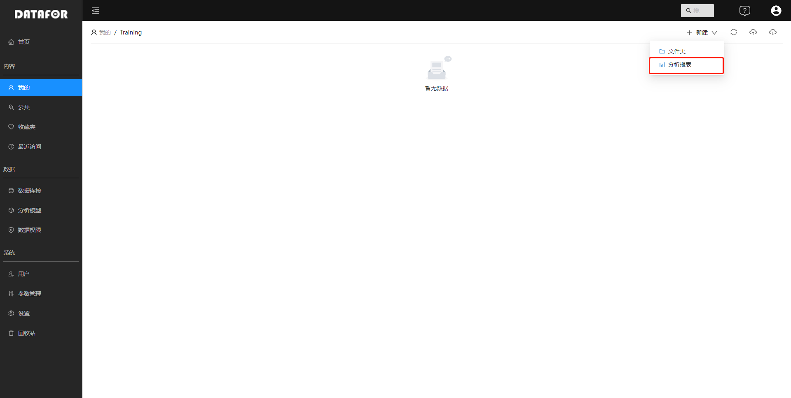
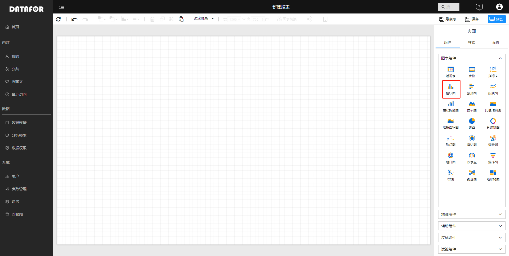
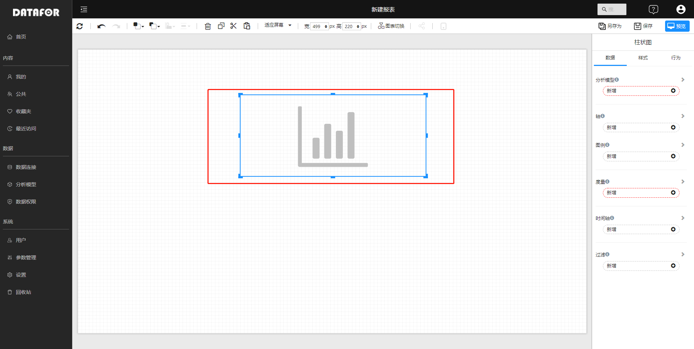
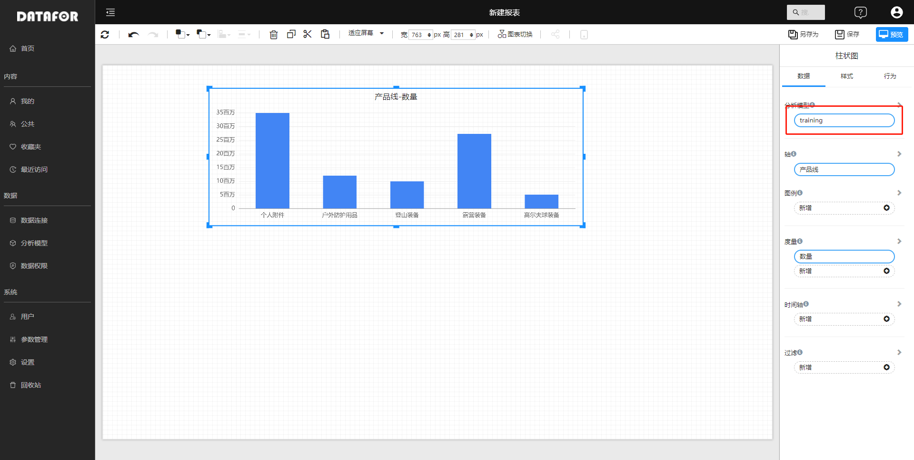
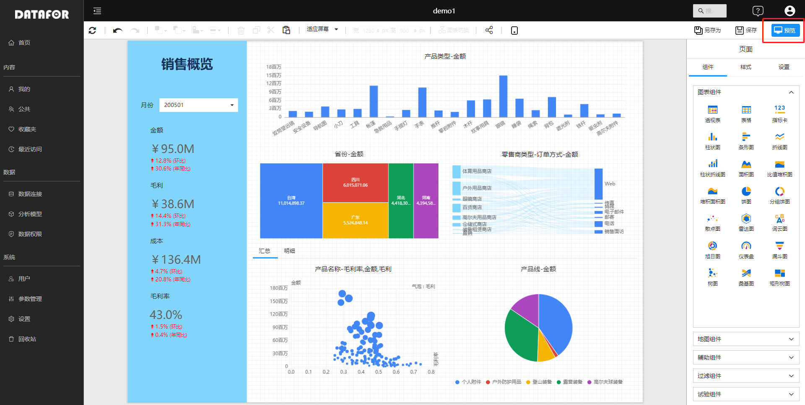

---
id: ksrm-rhzzdygym
title: First analysis report
sidebar_position: 2
---
# Make your first analysis report

You can create your first data analysis page in just three steps.

 

## 1.  Connect the data source

Connecting to a data source refers to establishing a connection between DATAFOR and your database (for example: PostgresSQL, MySQL, Oracle, SQL Server, etc.), so that DATAFOR can use and query the data in your database. This chapter takes the MySQL database as an example. We assume that you already have a MySQL database, and the data to be analyzed and displayed already exists in the database.

Select the "Datasource" menu in the menu navigation, and select the "MySQL" data source in the data source on the right.

 

Fill in the relevant information about the database connection, and save the connection after the connectivity test passes.

 

## 2. Create an analysis model

Select "Models" from the navigation menu and click "New Model"

 

Select "Connection or Dataset", specify Dimension Table and Fact Table

 

Drag the table fields to establish the relationship between the tables, or click the connection line and select "Edit" in the pop-up menu to modify the table relationship.
Select dimensions and fields on the Analytical Model panel to modify related properties.
Save the model when finished.

 

## 3. Create data analysis report

In the "Private" or "Public" folder, click the "New Analysis Report" button.

 

### Drag and drop components
Click the component icon in the "Components", and drag the component on the canvas.

 

 

### Set data
Select the analysis model in the "Analysis Model" box of the data panel, and set the relevant data properties of the component. Components will query data and render graphics.

 

### Adjust style
Drag and drop different components in the canvas, and set corresponding properties such as data and styles. We have completed the design of the first analysis report.

 

Click the "Preview" button to view your first analysis report.
